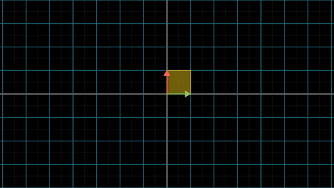
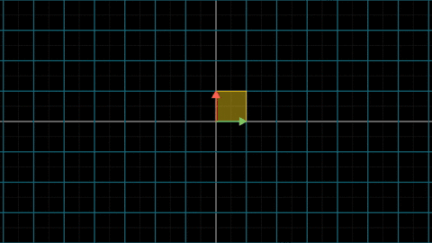
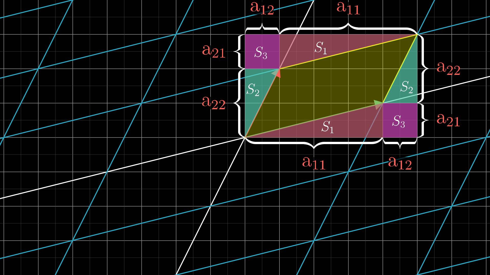
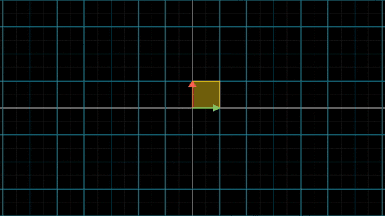
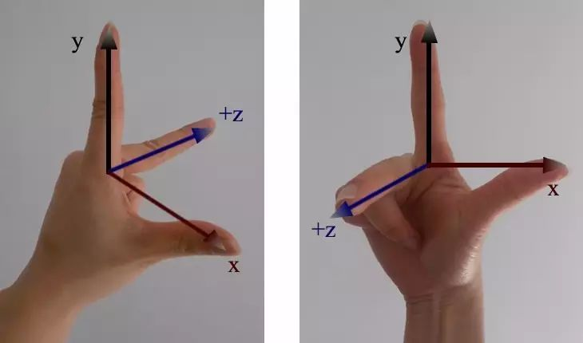

截止到现在为止，我们讨论的向量和矩阵的运算有这样的规律：输入矩阵和向量，输出还是矩阵或向量。

这一节，我们将讨论矩阵的一个全新运算：行列式。**行列式是这样一个函数：输入一个矩阵，输出一个数**。数学上通常将矩阵$$\mathbf{A}$$的行列式记做$$\det(\mathbf{A})$$或者$$\left| \mathbf{A}\right|$$

在几乎所有的线性代数书上，在定义了矩阵之后，马上就开始讲行列式。行列式的教科书上定义如下：

$$
\det(\mathbf{A})=\sum_{\sigma \in S_{n}} \operatorname {sgn}(\sigma )\prod_{i=1}^{n} a_{i,\sigma (i)}
$$

其中，$$S_n$$是集合$$\left\{1, 2, \dots, n \right\}$$排列$$\sigma$$的全体。$$\operatorname {sgn}(\sigma )$$根据排列$$\sigma$$的逆序数奇偶性定义的符号函数。

如果说我第一次见到矩阵的乘法定义时只是惊诧，那么我第一次见到矩阵的行列式定义时觉得是疯狂：为什么会有逆序数这么怪异的概念？

而行列式的性质也让人非常震惊：

- 行列式为零的矩阵不可逆，矩阵可逆与否这么大的信息量，居然可以只用一个数来表达？

- 对于两个矩阵$$\mathbf{A}$$，$$\mathbf{B}$$，有：$$\det(\mathbf{A}*\mathbf{B}) = \det(\mathbf{A}) * \det(\mathbf{B})$$，矩阵的乘法的行列式居然等于行列式的乘法！

就这样，虽然我后来对各种矩阵的行列式计算了然于胸，但是这些问题一直在我脑袋里盘绕，始终没有散去。

直到很久以后，我偶然在一篇文章中看到了行列式的几何意义，顿时有一种醍醐灌顶的感觉。行列式那些令人震惊的性质都是几何意义下的直观结论。

原来几何直观的威力这么大，写这个系列文章的念头也就是从那时起萌生的。

好了，不再回忆了，下面我们直接从行列式的几何意义讲起。

## 1 行列式的几何意义

行列式的几何意义非常直观：**行列式代表了线性变换前后空间的放大率**。

图中黄色区域在变换前后的面积比值就是行列式。

图中线性变换对应的变换矩阵为$$\mathbf{T} = \begin{bmatrix} 3 & 2 \\ 0 & 2 \end{bmatrix}$$。不知道这个矩阵从哪里来的同学，请返回去看[《矩阵的由来》](matrix.md)那篇文章。

那么，矩阵$$\mathbf{T}$$的行列式等于多少？

图中绿色的向量代表基向量$$\mathbf{e_1}$$，红色的向量代表基向量$$\mathbf{e_2}$$。

在变换之前，基向量张成的平行四边形是一个正方形，面积为1.

在变换之后，基向量张成的平行四边形底边为3，高为2，面积为6。

这个线性变换的面积放大率为6. 也就是说，矩阵$$\mathbf{T}$$的行列式为6，即$$\det(\mathbf{T}) = 6$$

下面我们通过计算几个常见矩阵的行列式，再次熟悉一下这个概念。

### 1.1 旋转矩阵的行列式

下图展示了旋转矩阵$$\mathbf{T}=\begin{bmatrix} \frac{\sqrt 2}{2} & -\frac{\sqrt 2}{2} \\ \frac{\sqrt2}{2} & \frac{\sqrt 2}{2} \end{bmatrix}$$对应的线性变换。

很明显，无论如何旋转，黄色区域的面积都不会改变。对于旋转矩阵，其行列式固定为1.

### 1.2 放大矩阵的行列式

下图展示了放大矩阵$$\mathbf{T}=\begin{bmatrix} 3 & 0 \\0&2\end{bmatrix}$$对应的线性变换。

放大矩阵并不会改变坐标系X轴和Y轴的方向，只是将其分别放大。

对于上图的变换来说，X轴被放大了3倍，Y轴被放大了2倍，相应的，面积就被放大了6倍。所以该矩阵的行列式等于6。

### 1.3 一般行列式的计算方法

前面的几个矩阵都比较特殊，很容易就计算出行列式。我们再来看看一般矩阵$$\begin{bmatrix} a_{11}& a_{12} \\ a_{21} & a_{22}\end{bmatrix}$$行列式的计算方法，比如下图中的线性变换：

很难一眼看出来黄色区域在变换之后的面积应该是多少。我们稍微动点手脚，将变换后的区域表示为下图：

一下子就能够看出来，黄色区域的面积为

$$
\begin{align*}
S &= (a_{11}+a_{12})(a_{21}+a_{22}) - 2S_1-2S_2-2S_3 \\
&= a_{11}a_{21}+a_{11}a_{22}+a_{12}a_{21}+a_{12}a_{22}-a_{11}a_{21}-a_{12}a_{22}-2a_{12}a_{21} \\
&=a_{11}a_{22}-a_{21}a_{12}
\end{align*}
$$

由此我们得到二阶矩阵的行列式计算公式

$$
\det(\begin{bmatrix} a_{11} & a_{12} \\ a_{21} & a_{22} \end{bmatrix}) = a_{11}a_{22}-a_{21}a_{12}
$$

而上图对应的变换矩阵是$$\begin{bmatrix} 4& 1 \\ 1 & 2 \end{bmatrix}$$，根据公式，这个矩阵的行列式为7，即黄色区域的面积为7.

## 2 行列式的性质

### 2.1 行列式与可逆性

我们再来看看上一篇[《逆矩阵》](inverse_matrix.md)中讨论过的那个不可逆矩阵。

在经过线性变换之后，空间被压缩到了一根直线上，而直线的面积为零。也就是说面积放大率为零。

所以这个线性变换对应矩阵的行列式一定等于0。

反过来推算也是成立的，如果一个矩阵的行列式等于零，说明它对应的线性变换将基向量压缩到了一根直线上，显然也就不可逆了。

### 2.2 矩阵乘法对应的行列式

矩阵的乘法对应着线性变换的复合，我们从线性变换的复合开始讲起。

线性变换$$f_1$$，对应的变换矩阵为$$\mathbf{T1} = \begin{bmatrix} 1& 2 \\ -2 & -1 \end{bmatrix}$$

矩阵$$\mathbf{T1}$$的行列式为3，即线性变换后面积放大3倍。

线性变换$$f_2$$，对应的变换矩阵为$$\mathbf{T2} =  \begin{bmatrix} 1& -1 \\ 1& 1 \end{bmatrix}$$

矩阵$$\mathbf{T2}$$对应的行列式为2，即线性变换后面积放大2倍。

平面上的一块区域面积为$$S$$，经过第一个线性变换$$f_1$$，面积放大3倍，即$$3* S$$，

继续对这块区域施加第二个线性变换$$f_2$$，这次面积会被放大2倍，即面积变为：$$2 * 3 *S$$，两次线性变换综合的效果为面积放大了6倍。

将复合线性变换对应的矩阵记为$$\mathbf{T3}$$，显然有$$\det(\mathbf{T3}) = 2 * 3 = 6$$

在[《矩阵的运算》](matrix_operations.md)文中，我们已经了解到，线性变换复合之后对应的变换矩阵为线性变换矩阵的乘积

即$$\mathbf{T3} = \mathbf{T2} * \mathbf{T1}$$

由此，我们可以得到：

$$
\det(\mathbf{T_3}) =\det(\mathbf{T_2}*\mathbf{T_1})= \det(\mathbf{T_2}) * \det(\mathbf{T_1}) 
$$

特别注意一点，在[《矩阵的运算》](matrix_operations.md)那一篇中，我们已经提到，矩阵的乘法运算不满足交换律。但是从上面的式子可以看出，虽然矩阵乘法运算不满足交换律，但是对行列式运算满足交换律。因为：

$$
\begin{align*}
 \det(\mathbf{T_2}*\mathbf{T_1}) 
&=\det(\mathbf{T_2}) * \det(\mathbf{T_1}) \\
&=\det(\mathbf{T_1}) * \det(\mathbf{T_2})  \\
&= \det(\mathbf{T_1}*\mathbf{T_2})
\end{align*}
$$

我们交换$$f_1$$和$$f_2$$的顺序，先施加$$f_2$$变换，再施加$$f_1$$变换，如下图：

容易验证，变换后的区域面积确实为6.

## 3 有向体积

### 3.1 行列式为负数的情况

再来看看矩阵$$\mathbf{T} = \begin{bmatrix} 1& 2 \\ 2 & 1 \end{bmatrix}$$的行列式，根据计算公式，容易求得$$\det(\mathbf{T})=-3$$。

不是说我们计算的是面积吗？怎么会有负值？

没错，我们计算的确实是面积，确切的说带方向的面积。我们注意一下这个线性变换的情况：

在变换的过程中，整个空间翻转了，也就是说空间的方向被改变了。行列式为负值正好表明了这种现象。

### 3.2 三维向量空间的情况

对于三维向量空间，行列式是线性变换前后平行六面体体积的放大率。

体积是很清楚的定义，问题是体积如何定向？

二维平面的方向很容易定义，只要定义最初朝向我们的方向为正向即可。

对于三维空间，我们定义右手坐标系为正向，左手坐标系为负向。

上图的左侧是左手坐标系，右侧是右手坐标系。如果只是单纯的旋转，无论如何都不可能将左手坐标系转换为右手坐标系，反之亦然。

对于三维空间，初始的坐标系为右手坐标系。

如果在变换之后，XYZ轴仍然能保持保持为右手坐标系，则说明空间的定向没有改变，此时矩阵的行列式一定为正值。

相反，如果变换之后，XYZ轴变为了左手坐标系，则说明空间的定向变了，此时矩阵的行列式则为负数。

> 注：这里所谓的空间定向，完全是人为规定的。不同的空间定向并无优劣之分，不能说行列式为正的矩阵就比行列式为负的矩阵高人一等。

### 3.3 更高维向量空间的情况

对于更高维向量空间，行列式是线性变换前后N维多面体的体积放大率。

体积还可以理解，麻烦的是空间定向。没有人见过三维以上的空间，更无法想象出高维空间定向改变的样子。

这个时候，不能用几何直观来解决问题了，要靠逻辑来解决问题。

为了把行列式的概念推广到更高维，数学家提出了逆序的概念，并通过逆序的奇偶性成功的解决了高维空间的定向问题。

我不会在此详细介绍逆序的概念，大家打开任意一本线性代数教材，都有对这个概念的详细描述。

这就是大学课本上行列式定义如此抽象的原因，这是把行列式推广到更高维度必须付出的代价。这种代价是值得的，因为：

**越是抽象的概念，应用范围就越广。越是直观的概念，其应用范围就越窄。**

数学上这样的例子比比皆是：射影几何是对欧式几何的抽象推广，群论是对一般代数系统的抽象推广，泛函是对一般函数的抽象推广。

当然，空口无凭，在下一篇文章中，我将举一个行列式在数学其他领域的具体应用，来证明这种推广确实有用。请大家关注我，及时获得下一篇文章的更新。
