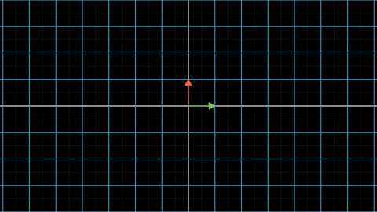

在上一篇中，我们讨论了行列式的几何意义：**行列式是线性变换前后空间的放大率。**

但是我们并没有给出高阶矩阵行列式的计算方法，因为行列式的计算起来实在是太麻烦了，一般都直接交给电脑计算。

不过这一节下面我们既然要讲行列式的应用，就躲不过计算方法了。

## 1 行列式的计算方法

### 1.1 二阶和三阶矩阵行列式的计算方法

上一节我们已经知道二阶矩阵行列式的计算方法了

$$
{\begin{vmatrix}a_{11} & a_{12} \\a_{21} &a_{22} \end{vmatrix}
=a_{11}a_{22} - a_{21}a_{12}}
$$

二阶矩阵的行列式计算方法很好记，对角线上的元素乘积减去反对角线上的元素乘积。

下面我们来点惊悚的：三阶矩阵行列式的计算方法

$$
{\begin{vmatrix}a_{11} & a_{12} &a_{13}\\a_{21} &a_{22} &a_{23}\\a_{31}&a_{32}&a_{33}\end{vmatrix}
=a_{11}a_{22}a_{33}+a_{12}a_{23}a_{31}+a_{13}a_{21}a_{32}-a_{31}a_{22}a_{13}-a_{32}a_{23}a_{11}-a_{33}a_{21}a_{12}}
$$

是不是觉得很复杂？我也这么觉得，所以为大家准备下面这个图片帮助记忆：

> 注：图片来自维基百科

图像上实线上的元素乘积之和，减去虚线上的元素乘积之和，就是三阶行列式啦。注意，这个助记法不是万能的，只对三阶矩阵有效，再高阶的矩阵就无效了。

### 1.2 对角矩阵的行列式计算方法

对于更高阶的矩阵，没有简单的方法能够计算出行列式。但是对于某些特殊矩阵，还是有简单方法的，比如对角矩阵。

所谓对角矩阵，就是只有对角线上有非零元的矩阵。我们上一节讨论过的放大矩阵$$\begin{bmatrix} a_{11} &0 \\ 0 & a_{22}\end{bmatrix}$$就是一个对角阵。这个矩阵对应的线性变换如下图：

容易看出，二阶对角阵不会改变空间的方向，只是将正方形的两边分别放大，变为了长方形。两边放大的比例分别为$$a_{11}$$和$$a_{22}$$，所以放大后的长方形面积为$$a_{11}*a_{22}$$。由此得到$$\begin{vmatrix} a_{11} &0 \\ 0 & a_{22}\end{vmatrix}=a_{11}*a_{22}$$

类似的，对于三阶对角阵$$\begin{bmatrix} a_{11} &0&0\\ 0 & a_{22}&0\\0&0&a_{33}\end{bmatrix}$$，这个线性变换同样不会改变基向量的方向，只是分别将正方体的三条边放大而已，正方体在变换后成为了一个长方体。该长方体的体积为$$a_{11}*a_{22}*a_{33}$$。所以$$\begin{vmatrix} a_{11} &0&0\\ 0 & a_{22}&0\\0&0&a_{33}\end{vmatrix}=a_{11}*a_{22}*a_{33}$$。

类似的，对于更高阶的矩阵，比如$$n$$阶对角阵，其线性变换也只是将$$n$$维立方体的$$n$$条边分别放大，最后变为一个$$n$$维长方体。由于对角线元素决定了每条边的放大比例，该$$n$$维立方体的体积，当然也就是对角线元素的乘积啦。即

$$
\begin{vmatrix} a_{11} &0 &\cdots&0\\ 0 & a_{22}&\cdots&0\\
\vdots&\vdots&\ddots&\vdots\\0&0&\cdots&a_{nn}\end{vmatrix}=a_{11}*a_{22}*\cdots*a_{nn}
$$

### 1.3 对角阵的简单记法

由于对角阵只有对角线上的元素为非零值，为了书写方便，我们用如下的简单记法来表示对角阵。比如二阶对角阵

$$
diag (\begin{bmatrix} a_{11}&a_{22}\end{bmatrix})=\begin{bmatrix} a_{11} &0 \\ 0 & a_{22}\end{bmatrix} \\
$$

三阶对角矩阵

$$
diag (\begin{bmatrix} a_{11}&a_{22}&a_{33}\end{bmatrix})=\begin{bmatrix} a_{11} &0&0\\ 0 & a_{22}&0\\0&0&a_{33}\end{bmatrix}
$$

类似的，对于更高阶的对角矩阵，有

$$
diag (\begin{bmatrix} a_{11}&a_{22}&\cdots&a_{nn}\end{bmatrix})=\begin{bmatrix} a_{11} &0 &\cdots&0\\ 0 & a_{22}&\cdots&0\\
\vdots&\vdots&\ddots&\vdots\\0&0&\cdots&a_{nn}\end{bmatrix}
$$

其中diag是diagonal(对角线)的缩写。

有了这样的简单记法，我们可以把$$n$$阶对角矩阵的行列式算法表示为下式：

$$
\det(diag (\begin{bmatrix} a_{11}&a_{22}&\cdots&a_{nn}\end{bmatrix}))=\prod_{i=1}^n a_{ii}
$$

$$\prod_{i=1}^n$$表示对序列连乘。

在讨论完对角阵的计算方法之后，终于可以讨论行列式在多元微积分中的一个应用了。

注意，**本文接下来的部分需要读者具备微积分的基础知识。如果没有学过微积分，可以跳过本文的剩余部分，不会影响对本系列后续文章的理解。**

## 2 多元微积分的变量替换

变量替换是多元微积分中常见的技巧，替换后可以极大的降低积分的难度。

### 2.1 球坐标转换

比如说我们知道半径为$$R$$的球面的方程为$$x^2+y^2+z^2=R^2$$，如果要求出球的体积，那么只需要求出如下多重积分即可。

$$
\mathbf{V}=\iiint \limits_{x^2+y^2+z^2 ≤ R^2}\, \mathrm{d}x\,\mathrm{d}y\,\mathrm{d}z
$$

即将积分界限内所有的体积微元$$\mathrm{d}x\,\mathrm{d}y\,\mathrm{d}z$$累加即可。

问题在于：在X-Y-Z直角坐标系中，这个积分的三个坐标分量耦合在一起，积分界限非常难处理。

为了解决积分界限的问题，将积分变量转换到球面坐标系，如下图：

> 注：图片来自维基百科

直角坐标系中的点P的坐标为(x,y,z)，被转换为三个新的坐标分量$$(r, \theta, \phi)$$。其中$$r$$表示点P与坐标系原点O的距离，$$\theta$$为为OP与z轴的夹角，$$\phi$$为OP在x-y平面投影与x轴的夹角。

容易看出，$$r$$的取值范围为$$[0, +\infty)$$，$$\theta$$的取值范围为$$[0, \pi]$$，$$\phi$$的取值范围为$$[0, 2\pi)$$

在球面坐标系下，球面的方程得到了极大的简化，为$$r=R$$（你没有看错，就是这么简单）。

相应的，我们关心的积分界限也简化了许多，三个分量不再耦合，积分界限变为$$ \mathbf{V}=\int_{0}^{R}  \int_{0}^{\pi} \int_{0}^{2\pi}\, \cdots$$

新的问题来了，直角坐标系下的体积微元$$\mathrm{d}x\,\mathrm{d}y\,\mathrm{d}z$$和球面坐标系下的体积微元$$\mathrm{d}r\,\mathrm{d}\theta\,\mathrm{d}\phi$$，这两者之间有何关系？

### 2.2 体积微元的转换关系

要弄清楚两者之间的关系，首先要搞明白他们是怎么转换的。

球面坐标系到直角坐标系之间的转换关系如下式：

$$
\begin{cases}
x=r \sin(\theta)\cos(\phi) \\
y=r \sin(\theta)\sin(\phi) \\
z=r \cos(\theta)
\end{cases}
$$

明显的，这个转换关系是一个非线性变换。我们当然想将其变为线性的，这样就可以使用之前研究过的线性变换性质了。

怎么变，祭出全微分大法，分别求出x,y,z的全微分，如下式子：

$$
\begin{cases}
\mathrm{d}x=\frac{\partial x}{\partial r}\mathrm{d}r + \frac{\partial x}{\partial \theta}\mathrm{d}\theta+\frac{\partial x}{\partial \phi}\mathrm{d}\phi \\
\mathrm{d}y=\frac{\partial y}{\partial r}\mathrm{d}r + \frac{\partial y}{\partial \theta}\mathrm{d}\theta+\frac{\partial y}{\partial \phi}\mathrm{d}\phi \\
\mathrm{d}z=\frac{\partial z}{\partial r}\mathrm{d}r + \frac{\partial z}{\partial \theta}\mathrm{d}\theta+\frac{\partial z}{\partial \phi}\mathrm{d}\phi \\
\end{cases}
$$

这样，我们就成功的将$$\mathrm{d}x,\mathrm{d}y,\mathrm{d}z$$与$$\mathrm{d}x,\mathrm{d}y,\mathrm{d}z$$转换关系变为了线性关系。

既然是线性关系，当然就可以表示为矩阵向量相乘啦，如下：

$$
\begin{bmatrix} \mathrm{d}x \\ \mathrm{d}y\\ \mathrm{d}z \end{bmatrix} =
\begin{bmatrix} \frac{\partial x}{\partial r} & \frac{\partial x}{\partial \theta} & \frac{\partial x}{\partial \phi} \\
\frac{\partial y}{\partial r} & \frac{\partial y}{\partial \theta} & \frac{\partial y}{\partial \phi} \\
\frac{\partial z}{\partial r} & \frac{\partial z}{\partial \theta} & \frac{\partial z}{\partial \phi} \end{bmatrix}*
\begin{bmatrix} \mathrm{d}r \\ \mathrm{d}\theta \\ \mathrm{d}\phi \end{bmatrix}
$$

矩阵$$\begin{bmatrix} \frac{\partial x}{\partial r} & \frac{\partial x}{\partial \theta} & \frac{\partial x}{\partial \phi} \\ \frac{\partial y}{\partial r} & \frac{\partial y}{\partial \theta} & \frac{\partial y}{\partial \phi} \\ \frac{\partial z}{\partial r} & \frac{\partial z}{\partial \theta} & \frac{\partial z}{\partial \phi} \end{bmatrix}$$是由数学家雅可比(Jacobi)发现的。为了纪念他，我们将这个矩阵称之为雅可比(Jacobi)矩阵，一般记做$$\mathbf{J}$$。

上面的这个式子表明：

**虽然在整体上来说，这个坐标变换是非线性变换，但是在任意一块足够小的局部空间，都可以用线性变换完美近似。**

这太好了，我们前面一直在研究线性变换，很多线性变换的性质可以直接使用了。

比如，我们前面要找出体积微元$$\mathrm{d}x\,\mathrm{d}y\,\mathrm{d}z$$和体积微元$$\mathrm{d}r\,\mathrm{d}\theta\,\mathrm{d}\phi$$之间的关系。

这两个体积微元通过线性变换转换，我们要找出之间的关系，你想到了什么？

当然是行列式了，行列式衡量的就是线性变换前后体积的变化率。

把上面变换变为下式，就看得更清楚了。

$$
\begin{bmatrix} \mathrm{d}x & 0 & 0\\0&\mathrm{d}y&0\\0&0&\mathrm{d}z\end{bmatrix} =
\begin{bmatrix} \frac{\partial x}{\partial r} & \frac{\partial x}{\partial \theta} & \frac{\partial x}{\partial \phi} \\
\frac{\partial y}{\partial r} & \frac{\partial y}{\partial \theta} & \frac{\partial y}{\partial \phi} \\
\frac{\partial z}{\partial r} & \frac{\partial z}{\partial \theta} & \frac{\partial z}{\partial \phi}  \end{bmatrix}*
\begin{bmatrix} \mathrm{d}r & 0 & 0\\0&\mathrm{d}\theta &0\\0&0&\mathrm{d}\phi\end{bmatrix} 
$$

对这个式子两边求行列式，有：

$$
\mathrm{d}x\,\mathrm{d}y\,\mathrm{d}z =\det (\mathbf{J})*\mathrm{d}r\,\mathrm{d}\theta\,\mathrm{d}\phi
$$

我们根据偏微分的定义和三阶矩阵行列式的计算方法，可以求出球坐标转换的Jacobi矩阵行列式为

$$
\mathbf{J} = r^2\sin(\theta)
$$

由此，球的体积积分变为：

$$
 \mathbf{V}=\int_{0}^{R} r^2\, \mathrm{d}r \int_{0}^{\pi}\sin(\theta)\, \mathrm{d}\theta\int_{0}^{2\pi}\, \mathrm{d}\phi
$$

这个积分非常简单，以至于可以心算出来，为$$\frac{4}{3}\pi R^3$$，这正是球的体积公式。

### 2.3 Jacobi矩阵

我们举的例子是三维空间的坐标转换，但实际上很容易推广到N维（因为我们已经有N阶矩阵的行列式定义了）。我就不在此列出N维的情况了，任意一本讲多元微积分的教材都会讲到这一点。

我们再来回顾这一坐标变换过程，无疑能够认识到，起关键作用的就是Jacobi矩阵。正是因为这个矩阵，才把开始的非线性变换转换为了线性变换。

在工程实践领域中，几乎所有问题都是非线性问题，而我们对线性问题研究得非常透彻，对非线性问题的应对手段则很有限，所以一般都尝试将问题转换为线性。

Jacobi矩阵是将问题转换为线性的最有力武器，这使得Jacobi矩阵在实践中随处可见。如果你以后从事研究工作，相信我，一定会与Jacobi矩阵重逢的。

好了，矩阵的行列式已经讲得够多了。下一篇开始，我将讨论矩阵的特征值分解，那也是一个十分有趣的故事。长按下方图片关注我，不要错过特征值分解的几何意义哦。
