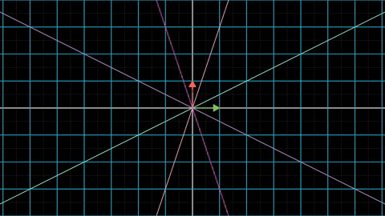
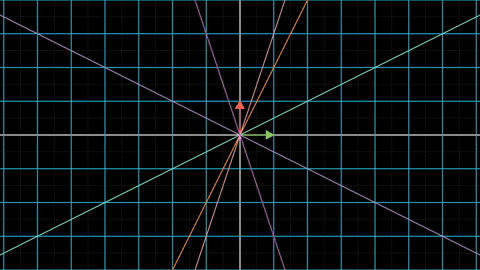
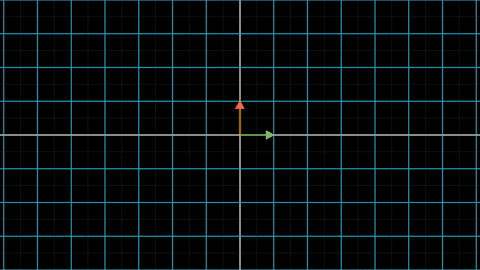
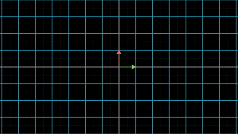
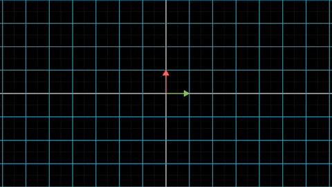
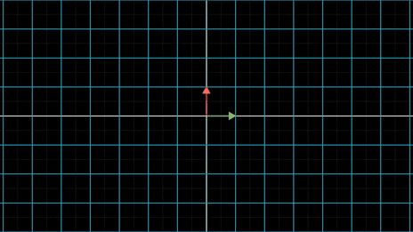
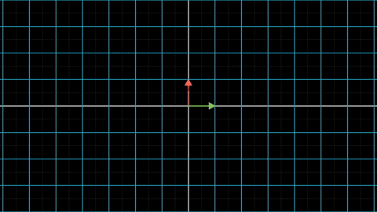
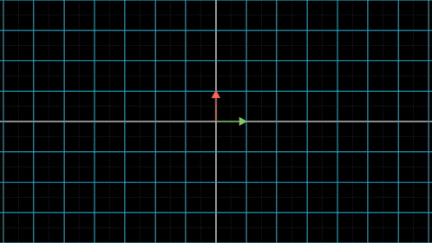

从这一篇开始，我们开始讨论特征值分解。数学上在研究一个东西的时候，第一要务就是要明确其定义。所以首先给出特征值和特征向量的定义，按照本系列文章的宗旨，当然首先是给出几何视角下的定义啦。

## 1 几何视角下的定义

相信你一定注意到了，线性变换是一种保线变换。也就是将直线依然变换为直线，如下图：

这在原理上也很容易理解，我们回过头来看线性变换的第二条性质：

$$
f(\alpha \mathbf{x}) = \alpha f(\mathbf{x})
$$

式子中，随着$$\alpha$$的变化，$$\alpha \mathbf{x}$$画出了变换前的直线，$$\alpha f(\mathbf{x})$$则画出了变换后的直线。换句话说，如果我们的线性变换输入的是一条直线，输出的一定也是一条直线。

> 注：保线变换是很弱的性质，很多其他变换比如仿射变换、射影变换都是保线变换。所以诸位一定不要把保线变换作为线性变换的充分条件哦。

线性变换虽然将直线变换为直线，但是变换前后的直线一般都不是同一根直线了。不过，会不会有一些幸运儿，在变换前后保持位置不变呢？答案是肯定的，比如下面这条橙色的直线。

专业的术语称这条直线为该线性变换的一维不变子空间，其实就是一根能在变换前后保持位置不变的直线而已。

相应的，所有落在这跟直线上的向量，在变换前后都可以保持方向不变。

我们把这些**在变换前后方向不变的向量称作该线性变换的特征向量**。

从上面的这个动图可以看出，虽然特征向量很幸运，躲过了被改变方向的厄运，但是他们的长度还是会有变化的。

我们将**线性变换前后特征向量的长度比值称之为特征值**，即特征值衡量了变换前后特征向量的放大率。这熟悉的措辞是不是让你想起了行列式的几何含义？其实这是正常的。说穿了，特征值就是这个一维线性空间变换的行列式。

注意到，落在这条特殊直线上的所有向量都是特征向量，也就是说，特征向量有无数多个。但所有这些特征向量对应的特征值都是相等的。注意下图各个特征向量的放大比例。

利用线性变换的第二条性质，很容易想明白这件事，我不在此多说，就留作思考题了。

## 2 代数视角下的定义

我们已经知道了特征向量和特征值的几何含义：特征向量就是在变换前后不改变方向的向量，特征值就是特征向量对应的放大率。

我们如何在茫茫向量海中找到这些特殊向量？这就必须从代数角度重新描述一遍这个过程了。

假设线性变换对应的矩阵为$$\mathbf{T}$$，那么，所谓的特征向量，就是满足下式的向量：

$$
\mathbf{T}\mathbf{x}=\lambda\mathbf{x}
$$

$$\mathbf{x}$$在变换前后只改变了长度，未改变方向。所以式子中的$$\mathbf{x}$$就是特征向量，$$\lambda$$则为对应的特征值。

这个式子正是一般教科书上对特征向量和特征向量的定义。

对于这个式子，稍作移项则有

$$
(\mathbf{T}-\lambda \mathbf{I})\mathbf{x} = \mathbf{0}
$$

这样，我们就把特征值和特征向量的求解变为了线性方程组的求解。

显然$$\mathbf{x} = \mathbf{0}$$是这个方程的解，但是我们需要的是非零解。

用线性变换的角度来观察这个方程组，矩阵$$\mathbf{T}-\lambda \mathbf{I}$$将一维向量$$\mathbf{x}$$变换为了零向量$$\mathbf{0}$$。也就是说，出现了降维的情况。

那么，根据我们在[《逆矩阵》](inverse_matrix.md)那一篇中的描述，$$\mathbf{T}-\lambda \mathbf{I}$$的行列式必须为零。即

$$
\det(\mathbf{T}-\lambda \mathbf{I}) = 0
$$

这就是一个简单的多项式求根了。根据这个式子求出特征值$$\lambda$$，再将特征值$$\lambda$$代入上面的线性方程组，就可以求出对应的特征向量了。

这么说可能大家还是一头雾水，下面我们找几个具体的例子做练习，肯定就明白了。

## 3 计算特征值和特征向量

### 3.1 两个特征向量的情况

以线性变换$$\mathbf{T} = \begin{bmatrix} 4 & -1 \\ 2 & 1 \end{bmatrix}$$为例子，这个线性变换如下图：

第一步，计算矩阵$$\mathbf{T}-\lambda \mathbf{I} = \begin{bmatrix}4-\lambda & -1\\2 & 1-\lambda \end{bmatrix}$$的行列式，二阶矩阵的行列式即为两条对角线元素乘积之差，即

$$
\begin{align}
&\det(\mathbf{T}-\lambda \mathbf{I} ) = 0 \\ 
&\Rightarrow (4-\lambda)(1-\lambda)+2=0\\
 &\Rightarrow \lambda ^2 -5\lambda +6= 0\\
&\Rightarrow  (\lambda -2)(\lambda -3) = 0 \\
\end{align}
$$

很显然，这个式子有两个根，分别为2和3。所以这个线性变换有两个特征值，记做$$\lambda _1 = 2$$，$$\lambda _2 = 3$$

接下来分别求出两个特征值对应的特征向量。

先看$$\lambda _1 = 2$$，将其代入$$(\mathbf{T}-\lambda \mathbf{I})\mathbf{x} = 0$$，即有

$$
\begin{align}
&\begin{bmatrix}
4-\lambda_1 & -1\\
2 & 1-\lambda_1
\end{bmatrix} \mathbf{x_1}=0  \\
&\Rightarrow
 \begin{bmatrix}
2 & -1\\
2 & -1
\end{bmatrix} \begin{bmatrix} x_1 \\ x_2 \end{bmatrix}=0 
\end{align}
$$

容易看出，只要$$x_2 = 2x_1$$就可以满足这个线性方程组，就设定$$\mathbf{x_1}=\begin{bmatrix} 1 \\2 \end{bmatrix}$$好了。

类似的手段可以得出特征值$$\lambda _2 = 3$$对应的特征向量为$$\mathbf{x_1}=\begin{bmatrix} 1 \\1 \end{bmatrix}$$。

下面我们画出两个特征向量在线性变换下的变化效果：

是不是所有二阶矩阵都有两个特征向量？当然不是啦，请继续往下看

### 3.2 只有一个特征向量的情况

接下来我们将求解这个线性变换的特征值，如下图

这个线性变换对应的矩阵为$$\mathbf{T} = \begin{bmatrix}
1 & -1\\
1 & 3
\end{bmatrix}$$。首先求出特征值

$$
\begin{align}
&\det(\mathbf{T}-\lambda \mathbf{I} ) = 0 \\ 
&\Rightarrow (1-\lambda)(3-\lambda)+1=0\\
&\Rightarrow \lambda ^2 -4\lambda +4= 0\\
&\Rightarrow  (\lambda -2)^2 = 0 \\
\end{align}
$$

啊哈，这个矩阵只有一个特征值$$\lambda = 2$$，这是一个重根。这个特征值对应的特征向量是什么？

$$
\begin{align}
&\begin{bmatrix}
1-\lambda_1 & -1\\
1 & 3-\lambda_1
\end{bmatrix} \mathbf{x}=0  \\
&\Rightarrow
\begin{bmatrix}
-1 & -1\\
1 & 1
\end{bmatrix} \begin{bmatrix} x_1 \\ x_2 \end{bmatrix}=0 
\end{align}
$$

容易求出，其特征向量为$$\begin{bmatrix} 1 \\ -1 \end{bmatrix}$$，也就是说，这个矩阵只有一个特征值，并且也只有一个特征向量。

### 3.3 没有特征向量的情况

当然也存在某些线性变换没有特征向量了，比如我们的老朋友旋转变换，如下图

这个线性变换对应的矩阵为$$\mathbf{T} = \begin{bmatrix}
1 & -1\\
1 & 1
\end{bmatrix}$$

明显的，没有任何向量能在经历旋转变换之后仍然保持方向不变，所以该线性变换不存在特征向量。

当然也可以从代数角度验证这一点，比如先求特征值试试

$$
\begin{align}
&\det(\mathbf{T}-\lambda \mathbf{I} ) = 0 \\ 
&\Rightarrow (1-\lambda)(1-\lambda)+1=0\\
&\Rightarrow \lambda ^2 -2\lambda +2= 0\\
\end{align}
$$

显然，这个式子是无解的，该矩阵没有特征值，也就不存在特征向量了。

> 注：如果把解空间拓展到复数域，那么所有的矩阵都有特征值，也都存在对应的特征向量。不过这超出了我们这个简单教程的范围，以后有机会再讲吧。

## 4 特征值到底想说明什么？

现在，我们已经学会了怎么求解一个矩阵的特征值和特征向量。

特征向量能够在线性变换前后保持方向不变，这看起来只是像一个巧合而已，事实真的是这样吗？

当然不是！特征向量和特征值有着非常深刻的含义。

我们从特征向量(eigenvector)和特征值(eigenvalue)的英文名字就能看出端倪，这两个词都是用eigen-作为前缀，而eigen有本质的意思。

这暗示着特征值和特征向量反映了某些东西的本质。是的，特征值和特征向量反映了线性变换的本质。

“我读书少，你不是再骗我吧？怎么看特征向量就像一个中彩票的向量而已。凭什么说它反映了某种本质？？“

我这样的好人，怎么会骗大家呢。继续往下看，你就明白啦。

### 4.1 不同坐标系下的线性变换

在[《向量的坐标》](vector_coordinate.md)中谈到过，我们说向量的坐标时，一定要注意顺便说明这个坐标是在哪组基向量（即坐标系）下定义的。

**不同的坐标系下，同一个向量的坐标不一样。**

我们之前讨论的所有线性变换，默认的坐标系都是标准坐标系，即基向量组为$$\begin{Bmatrix} \mathbf{e_1} = \begin{bmatrix} 1 \\ 0 \end{bmatrix} &\mathbf{e_2} = \begin{bmatrix} 0 \\ 1 \end{bmatrix}\end{Bmatrix} $$

这个坐标系最常用，但这不是唯一的坐标系。任何两个不共线的向量都可以作为基向量组，同时也就确定了一个坐标系。

比如我们随便选两个向量$$\mathbf{e_1'} = \begin{bmatrix} 1 \\ -1 \end{bmatrix}$$和$$\mathbf{e_2'} = \begin{bmatrix} 1 \\ 1 \end{bmatrix}$$，这就构成了一个新的坐标系$$\begin{Bmatrix}\mathbf{e_1'} &\mathbf{e_2'}\end{Bmatrix}$$

在坐标系$$\begin{Bmatrix}\mathbf{e_1} &\mathbf{e_2}\end{Bmatrix}$$中的向量$$\mathbf{x} = \begin{bmatrix} 5 \\1 \end{bmatrix}$$，可以被表示为

$$
\mathbf{x} = 2* \begin{bmatrix} 1 \\ -1 \end{bmatrix} + 3 * \begin{bmatrix} 1 \\ 1 \end{bmatrix}
$$

也就是说，在坐标系$$\begin{Bmatrix}\mathbf{e_1'} &\mathbf{e_2'}\end{Bmatrix}$$中，向量$$\mathbf{x}$$的坐标为$$ \begin{bmatrix} 2 \\ 3 \end{bmatrix}$$

在[《矩阵的由来》](matrix.md)那篇文章中，我们谈到过，线性变换的矩阵其实就是把变换后的基向量坐标并列起来。由于不同坐标系下，向量的坐标不一致，这意味着：

**在不同的坐标系下，同一个线性变换对应的矩阵不一样。**

接下来我们举一个具体的例子，大家就看得更清楚了

### 4.2 一个具体的例子

以在3.1节研究过的这个线性变换$$f$$为例，其对应的变换矩阵为$$\mathbf{T} = \begin{bmatrix} 4 & -1\\ 2 & 1 \end{bmatrix}$$。

按照习惯，这个变换矩阵$$\mathbf{T}$$是在坐标系$$\begin{Bmatrix}\mathbf{e_1} &\mathbf{e_2}\end{Bmatrix}$$下确定的。

接下来，我们将计算出$$f$$在坐标系$$\begin{Bmatrix}\mathbf{e_1'} &\mathbf{e_2'}\end{Bmatrix}$$中的变换矩阵$$\mathbf{T’}$$。

这很好办，只需要计算出来$$f(\mathbf{e_1'})$$和$$f(\mathbf{e_2'})$$在$$\begin{Bmatrix}\mathbf{e_1'} &\mathbf{e_2'}\end{Bmatrix}$$下的坐标即可。

按照下式计算出来$$f(\mathbf{e_1}')$$和$$f(\mathbf{e_2}')$$

$$
\begin{align}
f(\mathbf{e_1}') &= \mathbf{T} \mathbf{e_1'} = \begin{bmatrix} 5 \\ 1 \end{bmatrix} \\
f(\mathbf{e_2}') &= \mathbf{T} \mathbf{e_2'} = \begin{bmatrix} 3 \\ 3 \end{bmatrix}
\end{align}
$$

再求出$$f(\mathbf{e_1'})$$和$$f(\mathbf{e_2'})$$的坐标

$$
\begin{align}
f(\mathbf{e_1'})&=\begin{bmatrix} 5 \\ 1 \end{bmatrix}=2\mathbf{e_1'}+3\mathbf{e_2'}\\
f(\mathbf{e_2'})&=\begin{bmatrix} 3 \\3 \end{bmatrix}=0\mathbf{e_1'}+3\mathbf{e_2'} 
\end{align}
$$

那么，按照**向量坐标的定义**

- $$f(\mathbf{e_1}')$$在$$\begin{Bmatrix}\mathbf{e_1'} &\mathbf{e_2'}\end{Bmatrix}$$下的坐标为$$\begin{bmatrix} 2 \\ 3 \end{bmatrix}$$

- $$f(\mathbf{e_2}')$$在$$\begin{Bmatrix}\mathbf{e_1'} &\mathbf{e_2'}\end{Bmatrix}$$下的坐标为$$\begin{bmatrix} 0 \\ 3 \end{bmatrix}$$

将这这两个坐标并列起来，就得到了线性变换$$f$$在$$\begin{Bmatrix}\mathbf{e_1'} &\mathbf{e_2'}\end{Bmatrix}$$坐标系的变换矩阵$$\mathbf{T'}$$，为

$$
\mathbf{T'} = \begin{bmatrix}
2 & 0\\
3 & 3
\end{bmatrix}
$$

而$$f$$在坐标系$$\begin{Bmatrix}\mathbf{e_1} &\mathbf{e_2}\end{Bmatrix}$$下的变换矩阵为$$\mathbf{T} = \begin{bmatrix}
4 & -1\\
2 & 1
\end{bmatrix}$$。

$$\mathbf{T}$$与$$\mathbf{T'}$$看起来毫无相似之处，但是他们确实描述的是同一个线性变换！

那么，我们看到两个矩阵，怎么知道他们是否在描述同一个线性变换呢？秘密就隐藏在特征值中。

### 4.3 特征值的本质性

现在，我要告诉你一个惊天大秘密，$$\mathbf{T'}$$的特征值也是2和3（请大家自行验证），这意味着$$\mathbf{T'}$$和$$\mathbf{T}$$的特征值竟然完全相等！

这也太巧合了吧，其实这并不是偶然现象。

事实上：**虽然同一个线性变换的在不同的坐标系下，其变换矩阵不一样，但是所有这些变换矩阵特征值都相等。**

这意味着：**特征值组反映了线性变换的本质，它提供了一种与坐标系无关的方式来描述线性变换**。

是不是有点像基因的概念？虽然不同的土豆长得千姿百态，但是其基因组一定都是一样的。

所以，我们将其线性变换特征值组成的集合称为线性变换的谱（Spectrum）。

怎么样，是不是非常酷，特征值居然有这么漂亮的含义。

等等，为什么特征值这么酷？

其实仔细想也很好理解了，特征值描述的是特征向量长度的变化率。而同一个向量，无论在什么坐标系下来描述，其长度一定是相等的（把向量想象为现实世界的一根箭矢，无论以那里为参考系，箭矢的长度都是固定的）。那么作为长度变化率的特征值，当然也就与坐标系无关啦。

本来打算在这一节把特征值分解也讲了的，但这一节的篇幅已经够长啦，我们就留给下一节吧。
