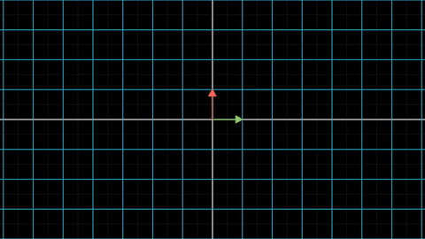
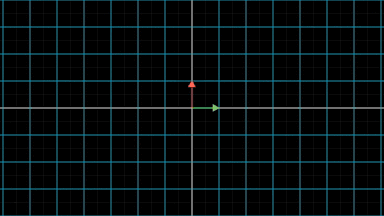
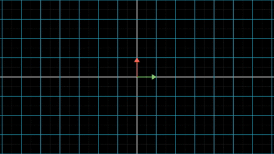
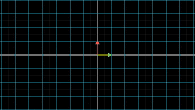
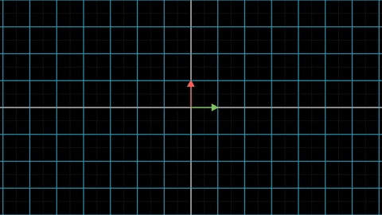

最近杂事颇多，这一篇线性代数的更新离上一篇有点远了。因此，首先简单回顾一下之前讲的内容：我们从向量开始，逐渐引出向量的坐标，从向量的坐标转换引出线性变换，最后再从线性变换引出了矩阵的概念，最终发现线性变换和矩阵是等价的关系。

上一篇从线性变换的复合引出了矩阵的加法和乘法运算，其中减法运算只是加法运算的特例。

## 1 逆矩阵

考虑如下的线性变换$$f$$，将向量空间$$\mathbf{V}$$变换到了$$\mathbf{V}'$$。

那么，存不存在线性变换$$g$$，与$$f$$复合之后，又将向量空间从$$\mathbf{V}'$$变回$$\mathbf{V}$$呢？

即$$g(f(\mathbf{v}))=\mathbf{v}$$

答案是肯定的。有图有真相：

向量空间$$\mathbf{V}$$的两个基向量为

$$
\mathbf{e_1}=\begin{bmatrix} 1 \\ 0\end{bmatrix}
\quad
\mathbf{e_2}=\begin{bmatrix} 0 \\ 1\end{bmatrix}
$$

变换到向量空间$$\mathbf{V}'$$之后，$$\mathbf{V}'$$的两个基向量为

$$
\mathbf{e_1}'=\begin{bmatrix} 2 \\ 1\end{bmatrix}
\quad
\mathbf{e_2}'=\begin{bmatrix} 1 \\ 2\end{bmatrix}
$$

根据我们在[《矩阵的由来》](matrix.md)那一篇中的理论，将这两个基向量并列在一起，就得到了$$f$$对应的变换矩阵为$$\mathbf{T_1} = \begin{bmatrix} 1 & 2 \\ 2 & 1 \end{bmatrix}$$

问题是，逆转乾坤的第二个线性变换$$g$$对应的变换矩阵是什么？

要想知道这个问题，就要求得$$ \left \{ \mathbf{e_1} \quad \mathbf{e_2}\right\}$$在$$ \left \{ \mathbf{e_1}' \quad \mathbf{e_2}'\right\}$$这组基下的表示。

我们以$$\mathbf{e_1}$$为例，假设$$\mathbf{e_1}$$可以表示为

$$
\mathbf{e_1} = x * \mathbf{e_1}' + y*\mathbf{e_2}'
$$

即

$$
\begin{bmatrix} 1 \\ 0\end{bmatrix} =
x* \begin{bmatrix} 2 \\ 1\end{bmatrix} +
y* \begin{bmatrix} 1 \\ 2\end{bmatrix}
$$

这是一个简单的二元一次方程组，求解过程我不再赘述。结果是$$x=\frac{2}{3}$$， $$y=-\frac{1}{3}$$

由此得到$$\mathbf{e_1}= \begin{bmatrix} \frac{2}{3} \\ -\frac{1}{3}\end{bmatrix}$$

类似的过程也可以得到$$\mathbf{e_2}= \begin{bmatrix} -\frac{1}{3} \\ \frac{2}{3}\end{bmatrix}$$

由此，我们得到的变换矩阵为$$\mathbf{T_2} = \begin{bmatrix} \frac{2}{3} & -\frac{1}{3} \\ -\frac{1}{3} & \frac{2}{3} \end{bmatrix}$$

线性变换$$g$$如下图所示：

**数学上，称线性变换$$g$$为线性变换$$f$$的逆变换，记做$$g = f^{-1}$$；矩阵$$\mathbf{T_2}$$为$$\mathbf{T_1}$$的逆矩阵，记做$$\mathbf{T_2}=\mathbf{T_1}^{-1}$$。**

显然，线性变换$$f$$也为线性变换$$g$$的逆变换，矩阵$$\mathbf{T_1}$$也为$$\mathbf{T_2}$$的逆矩阵。如下图

## 2 单位矩阵

在上一篇[《矩阵的运算》](matrix_operations.md)中，我们讲到，线性变换的复合对应着矩阵的乘法。那么线性变换$$f$$与$$f^{-1}$$复合之后有：$$f^{-1}(f(\mathbf{v}))=\mathbf{v}$$，也就是说这个复合线性变换什么也没干，将任意的向量$$\mathbf{v}$$还是变换到$$\mathbf{v}$$。这个复合线性变换对应的变换矩阵是什么？

$$
\begin{align*}
\mathbf{T} &= \mathbf{T_2} * \mathbf{T_1} \\
&= \begin{bmatrix} \frac{2}{3} & -\frac{1}{3} \\ -\frac{1}{3} & \frac{2}{3} \end{bmatrix} *
\begin{bmatrix} 1 & 2 \\ 2 & 1 \end{bmatrix} \\
&= \begin{bmatrix} 1& 0\\ 0 &1 \end{bmatrix}
\end{align*}
$$

**这个矩阵只有对角线的元素为1，其他元素都为0，数学上将这种样式的矩阵称之为单位阵（Identity matrix），单位阵通常用符号$$\mathbf{I}$$表示。**

任何向量$$\mathbf{v} = \begin{bmatrix} x \\ y \end{bmatrix}$$和单位阵相乘，都将毫发无伤的原路返回。

$$
\begin{align*}
\mathbf{I}* \mathbf{v} &= \begin{bmatrix} 1& 0\\ 0 &1 \end{bmatrix} *\begin{bmatrix} x \\ y \end{bmatrix} \\
&= \begin{bmatrix} 1*x+0*y \\ 0*x+1*y\end{bmatrix} \\
&= \begin{bmatrix} x \\ y \end{bmatrix}
\end{align*}
$$

这也从代数方面说明了，这两个线性变换复合之后，确实达到了什么也没做的效果，所有的向量都恢复到了原位。

读者可以自己证明一下，任何矩阵$$\mathbf{A} = \begin{bmatrix} a_{11}& a_{12}\\ a_{21} & a_{22} \end{bmatrix}$$和单位阵$$\mathbf{I}=\begin{bmatrix} 1& 0\\ 0 &1 \end{bmatrix}$$相乘(不管是左乘还是右乘)之后不变。即：

$$
\mathbf{A} * \mathbf{I}=\mathbf{I} * \mathbf{A} = \mathbf{A}
$$

从这个角度来讲，单位阵等价于四则运算乘法运算中的1， 任何数乘以1都保持不变。

## 3 逆矩阵的普遍性

我在[《向量空间》](vector_space.md)中那篇文章中讲过，平面上任意两根不共线的向量都可以构成二维向量空间$$\mathbf{R}^2$$的一组基。

经过线性变换$$f$$之后，原向量空间的两根基向量$$ \left \{ \mathbf{e_1} \quad \mathbf{e_2}\right\}$$变换到新向量空间，记为$$ \left \{ \mathbf{e_1}' \quad \mathbf{e_2}'\right\}$$。记$$f$$对应的变换矩阵为$$\mathbf{T}$$。

只要$$ \left \{ \mathbf{e_1}' \quad \mathbf{e_2}'\right\}$$不共线，我们就可以按照上一小节的步骤求出$$ \left \{ \mathbf{e_1} \quad \mathbf{e_2}\right\}$$在$$ \left \{ \mathbf{e_1}' \quad \mathbf{e_2}'\right\}$$的表示，相应的就可以求出$$\mathbf{T}$$的逆矩阵$$\mathbf{T}^{-1}$$。

这样看来，大部分线性变换都是可逆的。只要线性变换之后，两根基向量没有被变换到同一根直线上就可以。我们之前展示的大部分线性变换：旋转变换、放大变换、剪切变换都是可逆变换。

下图特意展示了一个不可逆的线性变换，容易看到，两根基向量在变换后落到了一根直线上。

由于线性变换和矩阵之间的一一对应关系，这也意味着：**大部分的矩阵都是可逆的，不可逆的矩阵只是极少的一部分**。因为不可逆矩阵的稀缺性，一个矩阵如果不可逆，我们称这个矩阵为奇异阵。

> 注：实际上，如果用Lebesgue测度来衡量，所有奇异阵组成的集合为零测集。换句话说，几乎所有的矩阵都是可逆矩阵。

## 4 不可逆的线性变换究竟意味着什么？

我们再仔细看看，当矩阵不可逆时发生了什么？原空间的两根基向量变换到一根直线上，这意味着原向量空间被压缩了，从二维平面变成了一根直线。读过《三体》的朋友会立刻想到一个词：降维打击。

所有二维向量空间的向量都需要两个坐标才能描述，在变换到一维直线后，只需要一个坐标就可以描述了。这意味着，原向量空间的部分信息彻底的损失掉了，所以线性变换也就不再可逆。

我们列出上面那个不可逆线性变换的变换之后的基向量$$ \left \{ \mathbf{e_1}' \quad \mathbf{e_2}'\right\}$$：

$$
\mathbf{e_1}'=\begin{bmatrix} 2 \\ 1\end{bmatrix}
\quad
\mathbf{e_2}'=\begin{bmatrix} 1 \\ \frac{1}{2}\end{bmatrix}
$$

明显能看出，$$\mathbf{e_2}' = \frac{1}{2} * \mathbf{e_1}'$$，即$$\mathbf{e_2}'$$可以用$$\mathbf{e_1}'$$表示出来。

如果一组向量中的某个向量可以被剩余的向量表示出来，我们就成这组向量是**线性相关**的。

显然，$$ \left \{ \mathbf{e_1}' \quad \mathbf{e_2}'\right\}$$是一组线性相关的向量。

而线性变换对应的矩阵就是变换后基向量并列在一起。我们可以立刻得出一个结论：

**把矩阵的每一列取出来组成一个向量组，如果这个向量组是线性相关的。那么这个矩阵对应的线性变换是不可逆线性变换，这个矩阵相应的也是不可逆矩阵。**

## 5 矩阵之间的除法

矩阵已经有了乘法、加法、减法运算，那么矩阵之间有没有除法运算呢，矩阵$$\mathbf{A}$$除以矩阵$$\mathbf{B}$$该如何定义？

这个问题猛一看可能让人没什么思路。

在遇到一个新问题的时候，首先就要想：能不能把这个问题化简为一个已经解决的问题。比如说，我们已经学会了实数之间的乘法，比如5*2=10，那么如何定义实数之间的除法，比如5/2该如何运算？我们可以用5*(1/2)来模拟除法运算，即用除数乘以被除数的倒数来模拟除法运算。

这提示我们，是不是可以用矩阵的乘法来模拟矩阵的除法运算？问题就变为，如何求出一个矩阵的倒数？

矩阵的倒数如何定义还是让人一头雾水。没关系，继续观察实数的倒数，2和其倒数1/2有什么关联？很明显的特点就是2*(1/2)=1.

而我们既然已经知道， 实数的1对应于矩阵中的单位阵$$\mathbf{I}$$。那么也能立即想到，所谓矩阵的倒数，应该就是矩阵的逆矩阵了。

由此可以得到，所谓$$\mathbf{A} / \mathbf{B}$$，其实就是$$\mathbf{A} * \mathbf{B}^{-1}$$罢了。

> 注：显然，如果 $$\mathbf{B}$$不可逆，那么这里的矩阵除法定义也就无效了。所以大部分的线性代数教材都没有讲矩阵的除法，但是在部分编程软件比如MATLAB中，确实有$$\mathbf{A} / \mathbf{B}$$的用法。

讲到这里，矩阵的运算部分就算正式结束了。下一节，我们将要探索一个全新的概念：行列式。
