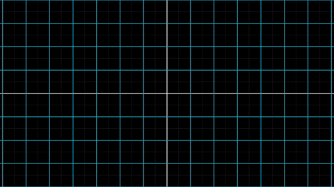
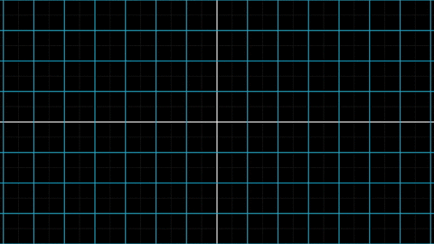
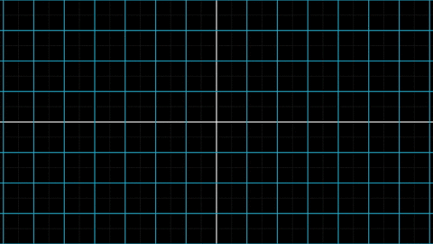
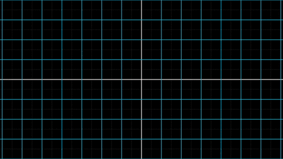
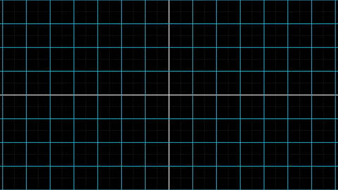

上一节我们讨论了向量的坐标，并且注意到在不同的坐标系（也就是不同的基，在下文中我将不做区分，混用这两个表述）中，向量的坐标不一样。为了解决同一向量在不同坐标系下的坐标转换问题，我们打算引入一个新的概念：线性变换。

## 1 线性变换的标准定义

考虑一个函数$$f$$，将向量空间$$V$$中的元素映射到向量空间$$W$$中，如果函数$$f$$满足下面两个式子：

$$f(\alpha\mathbf{v})=\alpha f(\mathbf{v})$$

$$f(\mathbf{v_1}+\mathbf{v_2})=f(\mathbf{v_1})+f(\mathbf{v_2})$$

那么，我们称$$f$$为线性变换。

有些书中也会将上面两个式子合并，用下式来定义线性变换：

$$f(\alpha \mathbf{v_1}+\beta \mathbf{v_2})=\alpha f(\mathbf{v_1})+\beta f(\mathbf{v_2})$$

这个定义也太平淡无奇了，没有任何值得注意的地方，也看不出与向量的坐标变换有何关系。然而重剑无锋，越是朴实的东西，在实际中应用的就越广泛。

## 2 几何视角下的定义

我们这个系列的文章叫几何视角下的线性代数，目的就是将抽象的概念形象化。因此我们给出线性变换的一个几何等价定义。

注意到线性变换的第一条性质，当$$\alpha$$等于0时，零向量在变换之后依然是零向量，这说明线性变换后，坐标系的原点不变。

线性变换的第二个性质，两个向量之和的变换，等于分别变换后的向量之和。而向量相加的法则是平行四边形法则，这说明线性变换将平行四边形依然变换为平行四边形。

这两条合在一起，说明线性变换就是这样一种变换：**保持坐标系原点不变，并且原坐标系的平行四边形变换到新坐标系后依然是平行四边形。**

下图显示了一个从二维向量空间$$\mathbf{R}^2$$到二维向量空间$$\mathbf{R}^2$$线性变换：

## 3 几个线性变换例子

为了几何直观，下面给出几个线性变换的例子。我们将主要以二维向量空间$$\mathbf{R}^2$$到二维向量空间$$\mathbf{R}^2$$为例来讨论线性变换。也就是说，变换前后都在同一个向量空间里，别着急，后边还会谈到不同向量空间之间的线性变换。

### 3.1 零变换

我们之前说过，只有一个零向量的集合也是向量空间，那么首先将$$\mathbf{R}^2$$转换到零向量空间试试。如下图

### 3.2 放大变换

将x轴和y轴都放大两倍

### 3.3 旋转变换

将坐标轴逆时针旋转45°

### 3.4 剪切变换

x轴保持不变，将y轴倾斜45°

## 4 小结与展望

到现在为止，我们主要讨论了以下几点内容：

- 向量是带方向的量，可以进行加法和数乘运算

- 向量空间是满足运算封闭的向量集合

- 向量空间的基规定了向量的基本方向

- 空间内所有的向量都可以用基的线性相加来表示，线性相加的系数构成了向量的坐标

- 向量空间可以选取不同的基，同一个向量在不同的基下坐标不一样

也就是说，在讨论线性变换之前，向量空间是一个静止的空间。所有的向量都各归其位，每个基也安静的躺在空间中，形成空间的坐标系框架。

静止的世界很无趣，所以线性变换定义了一种向量空间之间的运动，所有的向量都可以借助这个运动迁移到新的向量空间中。这种动态性是线性代数在现实世界有广泛应用的根源，因为现实世界的大部分现象可以归纳为：有几个源要素，这几个源要素相互作用，产生了一些新的结果要素。线性变换恰好为描述这些现象提供了非常好的数学语言。

线性变换是线性代数的核心概念，我们后面将会看到：矩阵、矩阵的乘法、行列式、以及特征值特征向量，所有这些都可以从线性变换引出来。

好戏就要开场咯。
