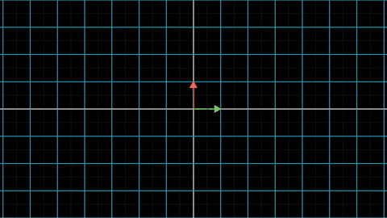
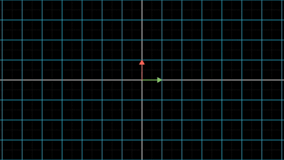

上一节已经说到，线性变换就是将一个向量空间映射到另外一个向量空间。不过在上一节我们关注的是向量空间整体在线性变换下变化，这一节我们就要关注是具体某一根向量在线性变换下的命运。

为了几何直观，我们还是主要以$$\mathbf{R^2}$$到$$\mathbf{R^2}$$的变换为例。

此外，还要补充的一点就是：之前为了排版方便，我们表示向量都是横着写：$$ \mathbf{v}=\begin{bmatrix} x  &y \end{bmatrix} $$，这一节开始，我们将使用教科书上的标准方式，竖着写：$$\mathbf{v}= \begin{bmatrix} x  \\ y \end{bmatrix} $$。这只是书写方式的不同，并不影响之前讨论内容的正确性。

## 1 向量经过线性变换后的坐标

选取向量空间$$\mathbf{V}$$的基向量为$$ \left \{ \mathbf{e_1} \quad \mathbf{e_2}\right\}$$，那么$$\mathbf{V}$$中的任意向量$$\mathbf{v} $$都可以表示为：

$$
\mathbf{v} = x*\mathbf{e_1} + y *\mathbf{e_2}
$$

即$$\mathbf{v}$$的坐标为$$ \begin{bmatrix} x  \\ y \end{bmatrix} $$

现在，使用线性变换$$f$$将$$\mathbf{V}$$变换到向量空间$$\mathbf{V'}$$中，同时也将向量$$\mathbf{v}$$变换到$$\mathbf{v'}$$，那么根据线性变换的定义：

$$
\mathbf{v'}=f(\mathbf{v})=x\ f(\mathbf{e_1})+y\ f(\mathbf{e_2})
$$

如果我们选取向量空间$$\mathbf{V'}$$的基向量为$$ \left \{ f(\mathbf{e_1}) \quad f(\mathbf{e_2})\right\}$$，那根据定义，$$\mathbf{v'}$$在这组基下的坐标仍然为$$ \begin{bmatrix} x \\ y \end{bmatrix} $$。

也就是说，在这种选择基的方式下，$$\mathbf{v}$$和$$\mathbf{v'}$$的坐标一致。

下图显示了这个过程：

在图中，向量空间$$\mathbf{V}$$的基向量$$ \left \{ \mathbf{e_1} \quad \mathbf{e_2}\right\}$$为

$$
\mathbf{e_1} = \begin{bmatrix} 1  \\ 0 \end{bmatrix}  
\quad
\mathbf{e_2} = \begin{bmatrix} 0  \\ 1 \end{bmatrix}
$$

其中$$\mathbf{e_1}$$为绿色，$$\mathbf{e_2}$$为红色。

在这组基下，$$\mathbf{V}$$中的向量$$\mathbf{v}=\begin{bmatrix} -1 \\ -2 \end{bmatrix}$$，$$\mathbf{v}$$在图中为黄色。

变换后的向量空间$$\mathbf{V'}$$的基向量$$ \left \{ \mathbf{e_1'} \quad \mathbf{e_2'}\right\}$$为

$$
\mathbf{e_1'} =f(\mathbf{e_1})= \begin{bmatrix} 4 \\ 2\end{bmatrix} 
\quad
\mathbf{e_2'} = f(\mathbf{e_2})=\begin{bmatrix} -3  \\ 1 \end{bmatrix}
$$

在这组基下，变换到$$\mathbf{V'}$$中的向量$$\mathbf{v'}$$仍为$$\begin{bmatrix} -1 \\ -2 \end{bmatrix}$$。

而我们关注的是，$$\mathbf{v'}$$在原向量空间$$\mathbf{V}$$的坐标是什么？

这也不难，因为我们已经知道，向量$$\mathbf{v'}=-1* \mathbf{e_1'}+-2* \mathbf{e_2'}$$，而且还知道$$ \left \{ \mathbf{e_1'} \quad \mathbf{e_2'}\right\}$$在$$\mathbf{V}$$中的坐标，那么

$$
\begin{align}
\mathbf{v'} &=-1* \mathbf{e_1'}+\ -2* \mathbf{e_2'} \\
& =-1 * \begin{bmatrix} 4 \\ 2\end{bmatrix}  + \ -2*\begin{bmatrix} -3 \\ 1\end{bmatrix} \\
&= \begin{bmatrix} -1*4 \\ -1*2\end{bmatrix}  + \begin{bmatrix} -2*-3 \\ -2*1\end{bmatrix} \\
&=\begin{bmatrix}-4\ +\ 6 \\ -2\ +\ -2\end{bmatrix} \\ 
&=\begin{bmatrix} 2\\ -4\end{bmatrix}
\end{align}
$$

由此，得到向量$$\mathbf{v'}$$在原向量空间$$\mathbf{V}$$的坐标为$$\begin{bmatrix} 2 \\ -4\end{bmatrix}$$

## 2 矩阵的由来

现在考虑$$\mathbf{V}$$中的任意一个向量$$ \mathbf{v}=\begin{bmatrix} x  \\y \end{bmatrix} $$，其经过线性变换的向量$$\mathbf{v'}$$在$$\mathbf{V}$$中的坐标也可以按照上述流程计算得到：

$$
\begin{align}
\mathbf{v'} &=x* \mathbf{e_1'}+y* \mathbf{e_2'} \\ 
& =x * \begin{bmatrix} 4 \\ 2\end{bmatrix}  + y*\begin{bmatrix} -3 \\ 1\end{bmatrix} \\
&= \begin{bmatrix} x*4 \\ x*2\end{bmatrix}  + \begin{bmatrix} y\ *\ -3 \\ y\ *\ 1\end{bmatrix} \\
&=\begin{bmatrix} 4*x\ +\ -3*y \\  2*x\ +\ 1*y\end{bmatrix} 
\end{align}
$$

可以看出，只要知道$$ \left \{ \mathbf{e_1'} \quad \mathbf{e_2'}\right\}$$的坐标，就能够按照上述流程求出$$\mathbf{v'}$$在$$\mathbf{V}$$中的坐标。

由于这**两个基向量总是同时出现，并且一起发挥到坐标转换的作用**，我们将其放在一起，即：

$$
\mathbf{T}=\begin{bmatrix} \mathbf{e_1'} & \mathbf{e_2'} \end{bmatrix}
= \begin{bmatrix} 4 & -3 \\ 2&1 \end{bmatrix}
$$

并且定义：像$$\mathbf{T}$$这种由**数字组成的矩形阵列为矩阵**。

而上边的坐标转换过程其实就是矩阵和向量的乘法定义。

一般用大写粗体字母表示矩阵，细心的同学会发现我们上面表示向量空间用的也是大写粗体字母。没关系，根据上下文语境，一般情况下不会导致混乱。

## 3 矩阵和向量的乘法

矩阵和向量的乘法就是将矩阵的每一行和向量的元素分别相乘再加起来，下面给出了矩阵和向量乘法的更为形式化的定义：

假设矩阵$$\mathbf{M}=\begin{bmatrix} a_{11}& a_{12} \\ a_{21}&a_{22} \end{bmatrix}$$，向量$$\mathbf{w}=\begin{bmatrix} w_1 \\ w_2\end{bmatrix}$$

则$$\mathbf{M}$$和$$\mathbf{w}$$的乘法定义如下：

$$
\begin{align}
\mathbf{M}*\mathbf{w} &=\begin{bmatrix} a_{11}& a_{12} \\ a_{21}&a_{22} \end{bmatrix} *\begin{bmatrix} w_1 \\ w_2\end{bmatrix} \\
&= \begin{bmatrix} a_{11}*w_1+a_{12}*w_2 \\ a_{21}*w_1+a_{22}*w_2\end{bmatrix}
\end{align}
$$

大家可以和上面的坐标转换过程做个对照，就能发现这两者是完全一致的。

有了这个乘法定义，可以立刻将计算$$\mathbf{v'}$$坐标的过程简化为：

$$
\mathbf{v'} =\mathbf{T}*\mathbf{v}
$$

## 4 矩阵和线性变换的关系

在本科学习矩阵的时候，总是感觉矩阵就像孙悟空一样，是从石头里突然出现的。

现在大家应该明白了：**矩阵只不过是对线性变换的描述。对一个向量施行线性变换，则等价于用变换矩阵和这个向量相乘。**

矩阵和向量之间的乘法规则，是向量数乘和加法运算的自然延伸。当我们定义好向量的运算时候，矩阵和向量之间的运算也就随之确定了。

在下一节中，我们将看到，矩阵的乘法也能够从向量的数乘和加法中推导出来。

实际上：**矩阵和线性变换是一一对应的关系**（数学的专业说法是：矩阵和线性变换是一个同构）。

任意给出一个矩阵，只需要将矩阵的每一列作为变换后的基向量，就可以确定出一个线性变换。

任意一个线性变换，只需要将线性线性变换后的基向量并列在一起就能够构成一个矩阵。

根据这个对应关系，我们再来回顾一下上一节的线性变换对应的矩阵

下面这几个变换，变换前的基向量都为：

$$
\mathbf{e_1} = \begin{bmatrix} 1  \\ 0 \end{bmatrix} 
\quad
\mathbf{e_2} = \begin{bmatrix} 0  \\ 1 \end{bmatrix}
$$

### 4.1 放大变换

不难看出，变换后的基向量只不过是将原来的基向量放大一倍。

将变换后的基向量并在一起，得到变换矩阵：

$$
\mathbf{T}=\begin{bmatrix} 2 & 0 \\ 0 & 2 \end{bmatrix}
$$

### 4.2 旋转变换

根据三角函数，容易求出，在逆时针旋转$$\theta$$角之后，两个基向量变为：

$$
\mathbf{e_1'} = \begin{bmatrix} \cos(\theta)  \\ \sin(\theta) \end{bmatrix} 
\quad
\mathbf{e_2'} = \begin{bmatrix} -\sin(\theta)  \\ \cos(\theta) \end{bmatrix}
$$

图中的旋转角度为45°，因此，对应的变换矩阵为：

$$
\mathbf{T}=\begin{bmatrix} \frac{\sqrt 2}{2} & -\frac{\sqrt 2}{2}  \\
\frac{\sqrt2}{2} & \frac{\sqrt 2}{2}  \end{bmatrix}
$$

### 4.3 剪切变换

这个变换中，$$\mathbf{e_1}$$没有改变，$$\mathbf{e_2}$$变为$$\begin{bmatrix} 1 \\ 1 \end{bmatrix}$$对应的变换矩阵为：

$$
\mathbf{T}=\begin{bmatrix} 1 & 1 \\ 0 & 1 \end{bmatrix}
$$

好了，这一节的内容就到这里。下一节我们将谈论矩阵的乘法运算以及逆矩阵。
