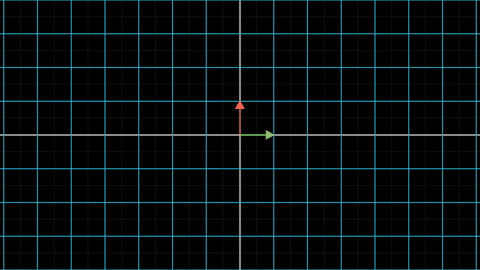
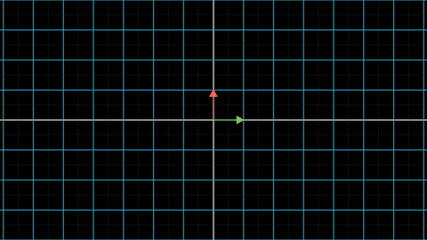
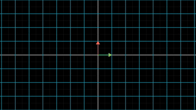
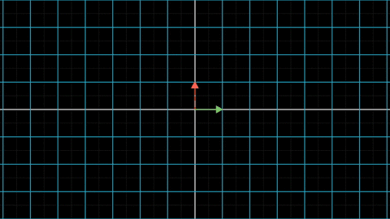
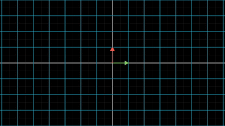

上一节我们根据向量在线性变换前后的坐标变化，引出了矩阵的概念。并且指出，线性变换和矩阵是一一对应的关系。对一个向量施加线性变换，等价于用这个线性变换对应的矩阵与向量相乘。因此，**研究矩阵就等价于在研究线性变换，这也是线性代数教材给了矩阵很多篇幅的原因。**

数学上给定一个概念之后，首先就要研究能对这个概念进行什么操作。我们既然已经有了矩阵的概念，那么接下来就要研究对矩阵有什么操作了，即矩阵能有哪些运算？

## 1 矩阵的数乘和加法

上一节，我们已经了解到，矩阵可以和向量相乘，这等价于对向量施加矩阵对应的线性变换。注意到，矩阵其实就是把向量并列在一起，所以**矩阵天生的继承了向量满足的运算：数乘和加法。**

利用向量的数乘运算和加法运算定义，容易发现：矩阵的数乘就是用一个数乘以矩阵的所有元素；矩阵的加法则是矩阵的所有元素对应相加。

比如对于矩阵$$\mathbf{A}=\begin{bmatrix} a_{11} & a_{12} \\ a_{21} & a_{22}\end{bmatrix}$$，矩阵$$\mathbf{B}=\begin{bmatrix} b_{11} & b_{12} \\ b_{21} & b_{22}\end{bmatrix}$$。那么两者之和为：

$$
\begin{align}
\mathbf{A} + \mathbf{B} &= \begin{bmatrix} a_{11} & a_{12} \\ a_{21} & a_{22}\end{bmatrix} + \begin{bmatrix} b_{11} & b_{12} \\ b_{21} & b_{22}\end{bmatrix} \\
&= \begin{bmatrix} a_{11}+b_{11} & a_{12}+b_{12} \\ a_{21}+b_{21} & a_{22}+b_{22}\end{bmatrix}
\end{align}
$$

对于任意实数$$\lambda$$，其和矩阵$$\mathbf{A}$$相乘如下式所示：

$$
\begin{align}
\lambda * \mathbf{A}&=\lambda * \begin{bmatrix} a_{11} & a_{12} \\ a_{21} & a_{22}\end{bmatrix} \\
&= \begin{bmatrix} \lambda * a_{11} & \lambda * a_{12} \\ \lambda * a_{21} & \lambda * a_{22}\end{bmatrix}
\end{align}
$$

由于矩阵和线性变换的一一对应关系，上述运算也就意味着如下结论。

如果$$f_1$$和$$f_2$$都为线性变换，两者对应的矩阵分别为$$\mathbf{T_1}$$ 和 $$\mathbf{T_1}$$ ，$$\lambda$$为任意实数，那么：

- $$\lambda\ f_1$$为也为线性变换，其对应的变换矩阵为$$\lambda \mathbf{T_1}$$

- $$f_1+f_2$$也为线性变换，其对应的变换矩阵为$$ \mathbf{T_1}+ \mathbf{T_2}$$

好了，矩阵的数乘运算和加法运算我们就不再多说了。如果同学们觉得还有点迷糊，在纸上按照线性变换的那两条性质，自己推导一下就明白了。

## 2 线性变换的复合

接下来我们考虑这样一个问题，如果我们对向量$$\mathbf{v}$$先施加一次线性变换$$f_1$$，得到了新的向量$$f_1(\mathbf{v})$$，接下来再对$$f_1(\mathbf{v})$$施加一次线性变换$$f_2$$，最后得到的$$f_2(f_1(\mathbf{v}))$$向量是什么？

为了弄明白这个问题，我们首先看一看$$f_2(f_1(\mathbf{v}))$$是个什么变换，如果是线性的话，问题就简单了。

$$
f_2(f_1(\lambda\ \mathbf{v}))=f_2(\lambda\ f_1(\mathbf{v}))=\lambda\ f_2(f_1(\mathbf{v}))
$$

线性变换的第一条性质满足。

$$
\begin{align}
f_2(f_1(\mathbf{v}+\mathbf{w}))
&=f_2(f_1(\mathbf{v}) + f_1(\mathbf{w}))\\
&=f_2(f_1(\mathbf{v})) + f_2(f_1(\mathbf{w}))
\end{align}
$$

太好了，线性变换的第二条性质也满足！

这意味着$$f_2(f_1(x))$$也是一个线性变换，我们得出了一个重要结论：

**线性变换的复合仍然是线性变换。**

既然$$f_2(f_1(x))$$是线性变换，那么它一定也对应有一个变换矩阵，记为$$\mathbf{T_3}$$。

我们的问题就转换为，$$\mathbf{T_3}$$的内容是什么？它与$$f_1$$的对应矩阵$$\mathbf{T_1}$$、$$f_2$$的对应矩阵$$\mathbf{T_2}$$有什么关系？

这个问题似乎有点难以下手。别害怕，接下来我们将抽丝剥茧，逐步给出答案。

首先把符号理清楚了，原始的向量空间记为$$\mathbf{V}$$，其基向量为$$ \left \{ \mathbf{e_1} \quad \mathbf{e_2}\right\}$$，该空间中向量$$\mathbf{v}$$的坐标为$$\mathbf{v}= \begin{bmatrix} x \\ y \end{bmatrix}$$。

### 2.1 线性变换$$f_1$$

$$\mathbf{V}$$经过线性变换$$f_1$$之后，变换到了向量空间$$\mathbf{V_1}$$中，根据我们上一节的结论，$$f_1$$对应的变换矩阵$$\mathbf{T_1}$$为：

$$
\begin{align}
\mathbf{T_1}&=\begin{bmatrix} f_1(\mathbf{e_1}) & f_1(\mathbf{e_2}) \end{bmatrix}\\
&=\begin{bmatrix} a_{11} & a_{12}\\ a_{21}&a_{22} \end{bmatrix}
\end{align}
$$

### 2.2 线性变换$$f_2$$

相应的，对于线性变换$$f_2$$，$$\mathbf{V}$$被变换到了向量空间$$\mathbf{V_2}$$中，$$f_2$$对应的变换矩阵$$\mathbf{T_2}$$为：

$$
\begin{align}
\mathbf{T_2}&=\begin{bmatrix} f_2(\mathbf{e_1}) & f_2(\mathbf{e_2}) \end{bmatrix}\\
&= \begin{bmatrix} b_{11} & b_{12} \\ b_{21} & b_{22} \end{bmatrix}
\end{align}
$$

### 2.3 线性变换$$f_2(f_1(x))$$

对于复合后的线性变换$$f_2(f_1(x))$$，其将$$\mathbf{V}$$被变换到了向量空间$$\mathbf{V_3}$$中，对应的变换矩阵$$\mathbf{T_3}$$为：

$$
\begin{align}
\mathbf{T_3}&=\begin{bmatrix} f_2(f_1(\mathbf{e_1})) & f_2(f_1(\mathbf{e_2})) \end{bmatrix} \\
&= \begin{bmatrix} c_{11} & c_{12} \\ c_{21} & c_{22} \end{bmatrix}
\end{align}
$$

## 3 矩阵的乘法

线性变换$$f_1$$和$$f_2$$是输入，所以$$\mathbf{T_1}$$和$$\mathbf{T_2}$$都是已知量。我们要找出$$\mathbf{T_3}$$与$$\mathbf{T_1}$$和$$\mathbf{T_2}$$的关系。

根据我们上一篇文章的结论，对向量$$\mathbf{v}$$施加线性变换$$f_1$$，等价于用变换矩阵和向量相乘。因此，可以求出$$f_1(\mathbf{v})$$ 的坐标：

$$
\begin{align}
f_1(\mathbf{v}) &= \mathbf{T_1}*\mathbf{v} \\
&= \begin{bmatrix} a_{11} & a_{12}\\ a_{21}&a_{22} \end{bmatrix} *\begin{bmatrix} x \\ y \end{bmatrix} \\
&= \begin{bmatrix} a_{11}*x+a_{12}*y \\ a_{21}*x+a_{22}*y \end{bmatrix}
\end{align}
$$

接下来我们要对$$f_1(\mathbf{v})$$ 再次施加线性变换$$f_2$$，继续用$$f_2$$的变换矩阵$$\mathbf{T_2}$$和$$f_1(\mathbf{v})$$相乘：

$$
\begin{align}
f_2(f_1(\mathbf{v})) &= \mathbf{T_2}*f_1(\mathbf{v})\\
&=\begin{bmatrix} b_{11} & b_{12}\\ b_{21}&b_{22} \end{bmatrix} *\begin{bmatrix} a_{11}*x+a_{12}*y \\ a_{21}*x+a_{22}*y\end{bmatrix} \\
&= \begin{bmatrix} b_{11}*(a_{11}*x+a_{12}*y)+b_{12}*(a_{21}*x+a_{22}*y ) \\ b_{21}*(a_{11}*x+a_{12}*y)+b_{22}*(a_{21}*x+a_{22}*y ) \end{bmatrix} \\
&= \begin{bmatrix} (b_{11}*a_{11}+b_{12}*a_{21})*x+(b_{11}*a_{12}+b_{12}*a_{22} )*y \\
(b_{21}*a_{11}+b_{22}*a_{21})*x+(b_{21}*a_{12}+b_{22}*a_{22} )*y
\end{bmatrix}\\
&= \begin{bmatrix} b_{11}*a_{11}+b_{12}*a_{21} & b_{11}*a_{12}+b_{12}*a_{22} \\
b_{21}*a_{11}+b_{22}*a_{21} & b_{21}*a_{12}+b_{22}*a_{22}
\end{bmatrix} *\begin{bmatrix} x \\ y\end{bmatrix}
\end{align}
$$

这样我们就得到了$$f_2(f_1(\mathbf{v}))$$的坐标。上面的式子看起来很复杂，其实只有加法和乘法，理解起来困难的同学，快去看上一篇[《矩阵的由来》](matrix.md)补课。

由于我们的向量$$\mathbf{v}$$可以取任何值，上面的式子也就意味着，线性变换$$f_2(f_1(\mathbf{v}))$$对应的变换矩阵为：

$$
\begin{bmatrix}
b_{11}*a_{11}+b_{12}*a_{21} & b_{11}*a_{12}+b_{12}*a_{22} \\
b_{21}*a_{11}+b_{22}*a_{21} & b_{21}*a_{12}+b_{22}*a_{22}
\end{bmatrix}
$$

而线性变换和矩阵的对应关系为严格的一一对应，因此这个矩阵必然和我们之前提到的$$\mathbf{T_3}$$相等：

$$
\begin{align}
\mathbf{T_3}&=\begin{bmatrix} c_{11} & c_{12} \\
c_{21} & c_{22} \end{bmatrix}\\
&=\begin{bmatrix}
b_{11}*a_{11}+b_{12}*a_{21} & b_{11}*a_{12}+b_{12}*a_{22} \\
b_{21}*a_{11}+b_{22}*a_{21} & b_{21}*a_{12}+b_{22}*a_{22}
\end{bmatrix}
\end{align}
$$

也就是说：

- $$c_{11}$$等于$$\mathbf{T_2}$$的第1行元素和$$\mathbf{T_1}$$的第1列元素分别相乘之和。

- $$c_{12}$$等于$$\mathbf{T_2}$$的第1行元素和$$\mathbf{T_1}$$的第2列元素分别相乘之和。

- $$c_{21}$$等于$$\mathbf{T_2}$$的第2行元素和$$\mathbf{T_1}$$的第1列元素分别相乘之和。

- $$c_{22}$$等于$$\mathbf{T_2}$$的第2行元素和$$\mathbf{T_1}$$的第2列元素分别相乘之和。

**这正是矩阵乘法的定义，$$\mathbf{T_3}$$的$$c_{ij}$$等于$$\mathbf{T_2}$$的第$$i$$行元素和$$\mathbf{T_2}$$的第$$j$$列元素相乘之和。**

我们再正式的描述一遍这个过程：

$$
\begin{align}
\mathbf{T_3} &= \mathbf{T_2}*\mathbf{T_1}\\
&= \begin{bmatrix} b_{11} & b_{12}\\
b_{21}&b_{22} \end{bmatrix}* \begin{bmatrix} a_{11} & a_{12}\\
a_{21}&a_{22} \end{bmatrix} \\
&=\begin{bmatrix}
b_{11}*a_{11}+b_{12}*a_{21} & b_{11}*a_{12}+b_{12}*a_{22} \\
b_{21}*a_{11}+b_{22}*a_{21} & b_{21}*a_{12}+b_{22}*a_{22}
\end{bmatrix}
\end{align}
$$

大家一定要牢记矩阵的乘法运算规则，这是线性代数的基础，后面要用到无数次。

## 3.1 矩阵乘法例子

上面我们讲了一大堆公式，之前没接触过矩阵的同学，会不会有种被绕晕的感觉呢？

别害怕，别忘了我们本系列的主题：几何视角下的线性代数。

下面我们从几何视角下理解矩阵乘法，先构造两个线性变换，这两个变换都是我们在《矩阵的由来》中讨论过的，分别是剪切变换和旋转变换。

线性变换$$f_1$$是剪切变换，保持X轴不动，将Y轴倾斜45°。如下图：

图中绿色向量代表$$\mathbf{e_1}$$，红色向量代表$$\mathbf{e_2}$$。

黄色则代表向量$$\mathbf{v}=\begin{bmatrix} 1 \\ 1 \end{bmatrix}$$，我们将观察$$\mathbf{v}$$在线性变换中的动向。

对应的变换矩阵为：

$$
\mathbf{T_1}=\begin{bmatrix} f_1(\mathbf{e_1}) & f_1(\mathbf{e_2}) \end{bmatrix}=
\begin{bmatrix} 1 & 1 \\ 0&1 \end{bmatrix}
$$

线性变换$$f_2$$是旋转变换，将坐标系逆时针旋转45°。如下图：

对应的变换矩阵为：

$$
\mathbf{T_2}=\begin{bmatrix} f_2(\mathbf{e_1}) & f_2(\mathbf{e_2}) \end{bmatrix}
=\begin{bmatrix} 1 & -1 \\ 1& 1 \end{bmatrix}
$$

这次我们连续使用这两个变换：

注意在变换结束后，两根基向量的坐标分别为$$\begin{bmatrix} 1 \\ 1 \end{bmatrix} \quad \begin{bmatrix} 0 \\ 2 \end{bmatrix} $$，这意味着我们的复合线性变换对应的矩阵为：

$$
\mathbf{T_3}=\begin{bmatrix} f_2(f_1(\mathbf{e_1})) & f_2(f_1(\mathbf{e_2})) \end{bmatrix}
=\begin{bmatrix} 1 & 0 \\ 1& 2 \end{bmatrix}
$$

请同学们自己验证一下，这正是$$\mathbf{T_2}*\mathbf{T_1}$$的结果。

我们不再分步骤画图，而直接根据矩阵$$\mathbf{T_3}$$，画出对应的线性变换，如下图：

显然，这和分步进行的最终结果是一致的。

## 3.2 矩阵乘法的不可交换性

上面我们是先施加的线性变换$$f_1$$，后施加的线性变换$$f_2$$，即先进行剪切变换，再进行旋转变换。

这次我们反过来，先进行$$f_2$$，再进行$$f_1$$，即先进行旋转变换，再进行剪切变换。

如下图：

令人惊奇的事情发生了，最终的变换结果和上边不一致！根据变换结束后的基向量，容易写出这个复合线性变换对应的矩阵为：

$$
\begin{bmatrix} f_1(f_2(\mathbf{e_1})) & f_1(f_2(\mathbf{e_2})) \end{bmatrix}
=\begin{bmatrix}2 & 0 \\ 1& 1\end{bmatrix}
$$

这正是$$\mathbf{T_1}*\mathbf{T_2}$$的结果，这和前面$$\mathbf{T_2}*\mathbf{T_1}$$的结果并不相等。于是我们得到一个重要结论：

**矩阵的乘法不满足交换律。**

这个可能会让许多同学惊诧，但是本质上来说：**矩阵乘法对应的是线性变换函数的复合，而函数的复合本来就不满足交换律**。

其实，我们不必惊诧于矩阵乘法运算不满足交换律，其实我们早就见识过不满足交换律的运算了。想想我们小学学的减法，$$2-1$$和$$1-2$$的结果都不一样，也就是说减法运算就不满交换律。交换律不必是运算必须满足的性质。

## 4 小结

至此，矩阵的乘法我们就讲完了。

我记得我第一次学习矩阵的乘法时，被矩阵乘法的怪异定义深深的惊住了。为什么要用左矩阵的某一行乘以右矩阵的某一列？这究竟是怎么想到的？

现在我们明白了，矩阵的乘法完全可以从线性变换中推导出来。**确切的说，在我们当初定义好向量的加法、数乘运算规则的那一瞬间，后续矩阵和向量的乘法、矩阵的数乘、矩阵之间的加法和乘法运算规则就随之确定了。**没有什么不可思议的地方，这一切都是自然而然的结果。

最后，我们再回顾一下矩阵和线性变换的对应关系：

1. 每一个线性变换都和一个矩阵一一对应。

2. 对向量施加线性变换，等价于用线性变换的对应矩阵和向量相乘。

3. 线性变换乘以某个数还是线性变换， 新的线性变换对应的矩阵为：用这个数和原线性变换的矩阵相乘。

4. 两个线性变换相加还是线性变换，和线性变换对应的矩阵为：原始两个线性变换的矩阵相加。

5. 两个线性变换的复合还是线性变换，复合线性变换对应的矩阵为：原始两个线性变换矩阵按顺序相乘。
