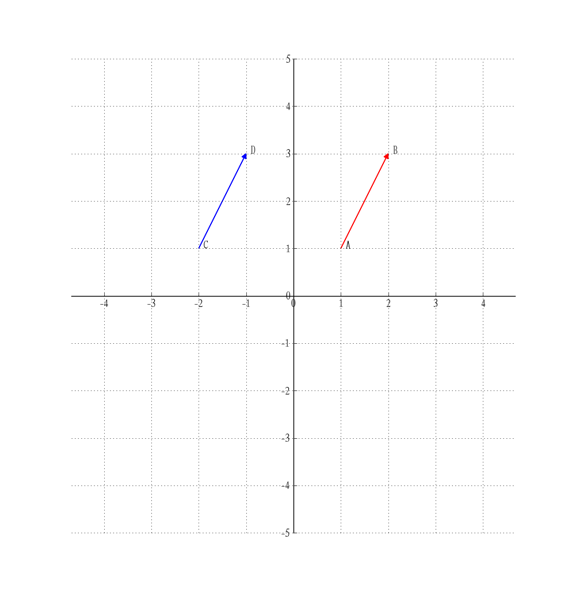
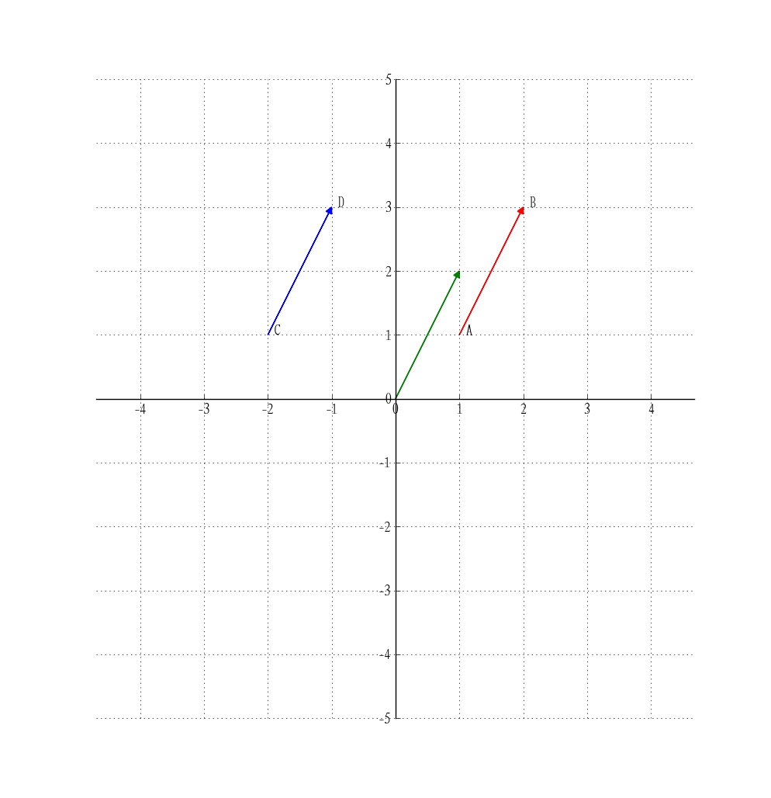
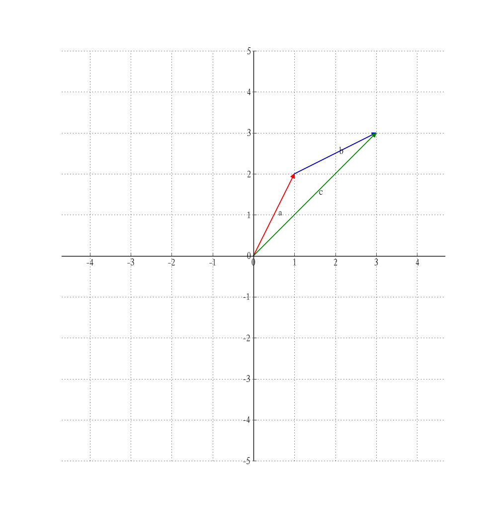

向量是线性代数中最基本的概念，可以说线性代数中的原子。那么我们的讨论就从向量开始吧。

## 1 向量是什么
假设在辽阔的二维平面上住着一个小精灵。现在，我们的小精灵要完成一次冒险，从平面上的点A，移动到点B。数学上将这一段位移抽象为**向量**，记做$\overrightarrow {AB}$，表示从A点移动到B点。向量这个名字非常贴切，就是**带方向的量**。

假设同样的小精灵，下次从点C移动到点D，记为向量$\overrightarrow {CD}$。我们研究的是小精灵移动的过程，并不关心小精灵具体的位置。对于这个过程而言，只要长度和方向确定，位移也就唯一确定了。从这个层面来讲，$\overrightarrow {AB}$和$\overrightarrow {CD}$是相等的。

显然，平面上有无穷多个向量都和$\overrightarrow {AB}$相等，而且把向量表示为$\overrightarrow {AB}$写起来也太麻烦。数学家总是喜欢简洁的东西，因此，数学上约定，用起点在原点的向量当做这群等价向量的代表，这样，我们用只需要用终点一个点就可以描述向量了。在数学中，我们一般用小写粗体字母来表示向量，如$ \mathbf{a, b, c \cdots} $

上图中的向量$ \mathbf{a} $的终点坐标为(2, 1)，为了和点区分开来，我们用中括号来表示向量，记做$\mathbf{a} = \begin{bmatrix} 2 & 1 \end{bmatrix}$

> 很多读者可能意识到，把向量的起点固定在原点之后，向量和点在数学形式上非常接近。这种相似性在射影几何中被发挥到了极致，在使用齐次坐标，并且引入了理想点和无穷远线之后，射影几何中的点和线是完全对等的关系。射影几何中所有的定理，点和线可以角色互换，定理依然是正确的。那又是一个很有意思的话题了，以后有机会再跟大家分享。
## 2 向量的运算
现在，平面上有了很多的向量。回忆我们上小学，学会自然数之后，就要学习自然数之间的运算。自然而然的，我们现在就要考虑向量之间能有什么运算。别担心，向量的运算比自然数的运算要少得多。我们现在从最简单的加法开始。
### 2.1 向量的加法
两个向量如何相加？我们还是从几何意义说起，既然向量表示的是位移，那么一个合理的猜测是：$ \mathbf{a} + \mathbf{b}$应该表示：先按照向量$\mathbf{a}$移动，再按照向量$\mathbf{b}$移动，最终移动到的目的地就是加法的结果。如图：

没错，这正是向量加法的定义，图中表示的就是$ \mathbf{c} = \mathbf{a} + \mathbf{b}$。
注意到，向量的加法可以交换顺序，因为先按照$\mathbf{b}$移动，再按照$\mathbf{a}$移动到达的是同一个目的地。如下图：

从图中可以看出，$ \mathbf{a} + \mathbf{b}$的等于$\mathbf{a}$和$\mathbf{b}$的张成的平行四边形的对角线。这就是向量相加的**平行四边形准则**。
我们不能每次计算向量相加就画出平行四边形吧。
上面几幅图中，向量$\mathbf{a} = \begin{bmatrix} 2 & 1 \end{bmatrix}$，向量$\mathbf{b} = \begin{bmatrix} 1 & 2 \end{bmatrix}$
从图中可以看出向量$\mathbf{c} = \begin{bmatrix} 2+1 & 1+2 \end{bmatrix} $

由此，可以得到向量相加的代数法则为：假设$\mathbf{a} = \begin{bmatrix} a_1 & a_2 \end{bmatrix}$，$\mathbf{b} = \begin{bmatrix} b_1 & b_2 \end{bmatrix}$，那么两者之和为：
$$\mathbf{c} = \mathbf{a}+\mathbf{b} =\begin{bmatrix} a_1+b_1 & a_2+b_2 \end{bmatrix} $$

等等，这代数法则和平行四边形法则表示的一个运算吗？好像不太明显啊，我们先按照x轴的方向移动，再按照y轴方向移动，就能够看的比较明白了，如下图：

其实，我们在日常生活中，经常不自觉地使用向量的加法。比如给别人指路：你沿着xx路走到下一个路口之后，再向右拐100米就到了，这个过程正是向量加法的文字描述啊。
### 2.2 向量的数乘
顾名思义，向量的数乘就是拿一个数乘以向量，这等于对向量的按比例放大或者缩小。这在几何上是相当直观的，如下图：

注意，还可以拿一个负数和向量相乘，这等于先把向量反过来，再按比例放大或者缩小。如下图：

既然数乘就是对向量的等比例放大，容易得到向量数乘的代数法则为：假设$\mathbf{a} = \begin{bmatrix} a_1 & a_2 \end{bmatrix}$，那么$\mathbf{a}$和实数$\lambda$的数乘结果为：
$$\lambda\mathbf{a} = \begin{bmatrix} \lambda*a_1 & \lambda*a_2 \end{bmatrix}$$

### 2.3 向量的减法
定义好了向量的加法和数乘，就很容易得到向量的减法了。
向量的减法等于$\mathbf{a}-\mathbf{b} = \mathbf{a} + (-1 * \mathbf{b}) $. 等于先对向量$\mathbf{b}$数乘-1之后，再与向量$\mathbf{b}$相加。我就不再画图表示了，相信大家想一下就明白了。向量的减法计算公式如下：
$$\mathbf{a}-\mathbf{b} =\begin{bmatrix} a_1-b_1 & a_2-b_2 \end{bmatrix} $$

好了，向量支持的运算就这么多。只有**加法，减法和数乘**，连向量之间的乘法和除法都没有，是不是比四则运算简单多了^^

### 2.4 推广到高维空间
上面我们说的向量都是在二维平面上，不过很容易推广到三维空间中，甚至在n维空间中也是成立的，只需要对向量的各个元素逐个操作即可。
假设有n维向量$ \mathbf{a} = \begin{bmatrix} a_1 & a_2& \cdots a_n \end{bmatrix} $，n维向量$ \mathbf{b} = \begin{bmatrix} b_1 & b_2 & \cdots b_n \end{bmatrix} $
那么，这两个向量的加法，减法，数乘分别定义如下：
$$\mathbf{a}+\mathbf{b} =\begin{bmatrix} a_1+b_1 & a_2+b_2 & \cdots & a_n+b_n\end{bmatrix} $$
$$\mathbf{a}-\mathbf{b} =\begin{bmatrix} a_1-b_1 & a_2-b_2 & \cdots & a_n-b_n\end{bmatrix} $$
$$\lambda\mathbf{a} =\begin{bmatrix} \lambda*a_1 & \lambda*a_2& \cdots \lambda*a_n\end{bmatrix} $$

### 2.5 延伸阅读
可能有读者会有疑问，你说的n维空间是啥，我咋想象不出来。没关系，我也想象不出来。但是只要我们熟练掌握向量在2维平面和3维空间下的运算，时间久了习惯成自然，慢慢的就能接受n维空间了。
实际上，n维空间是对现实世界更广泛的抽象。比如说要评价一个学生的期末考试成绩，我们把每门课的成绩收集在一起表示为一个向量。当只有两门课时，我们说[70, 90]代表的是某个学生的语文成绩为70分，数学成绩为90分。当扩展到三门课时，[70, 90, 80]，向量的前两项已然代表学生的语文数学成绩，第三项就表示学生的英语成绩为80分。那，如果这位学生还学习了物理、化学、生物呢，相应的，只需要把成绩继续加到这个向量中来就可以了。这就体现出了向量的威力，一个学生那么多门课的考试成绩，居然用n维空间中的一个向量就表示了。
在现在流行的**深度学习**中，不管输入数据如何变换：语音、文字、图像，最后都可以被表达为一个向量。深度学习中的各类模型都是在操作向量，可以说，线性代数正是深度学习的数学基础之一。