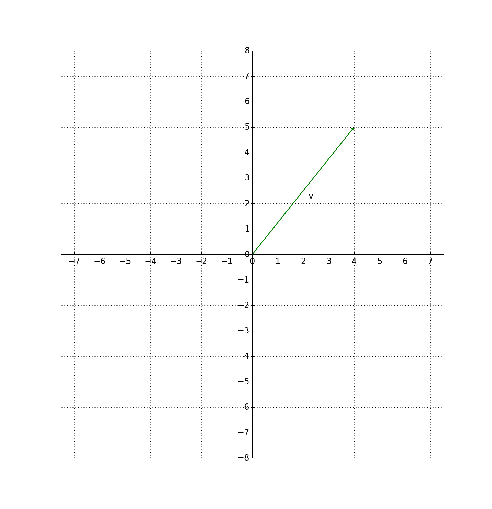
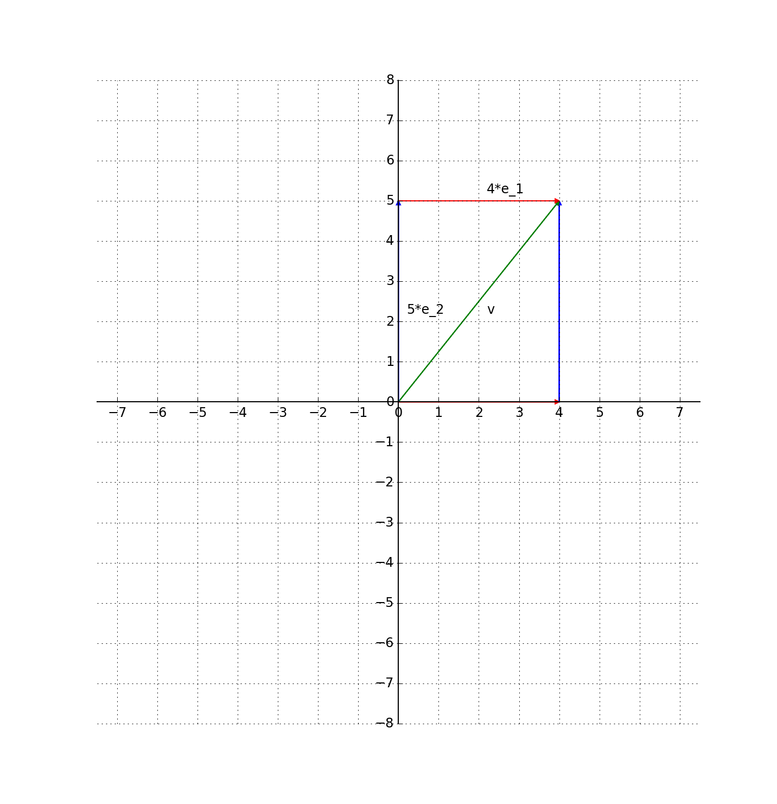
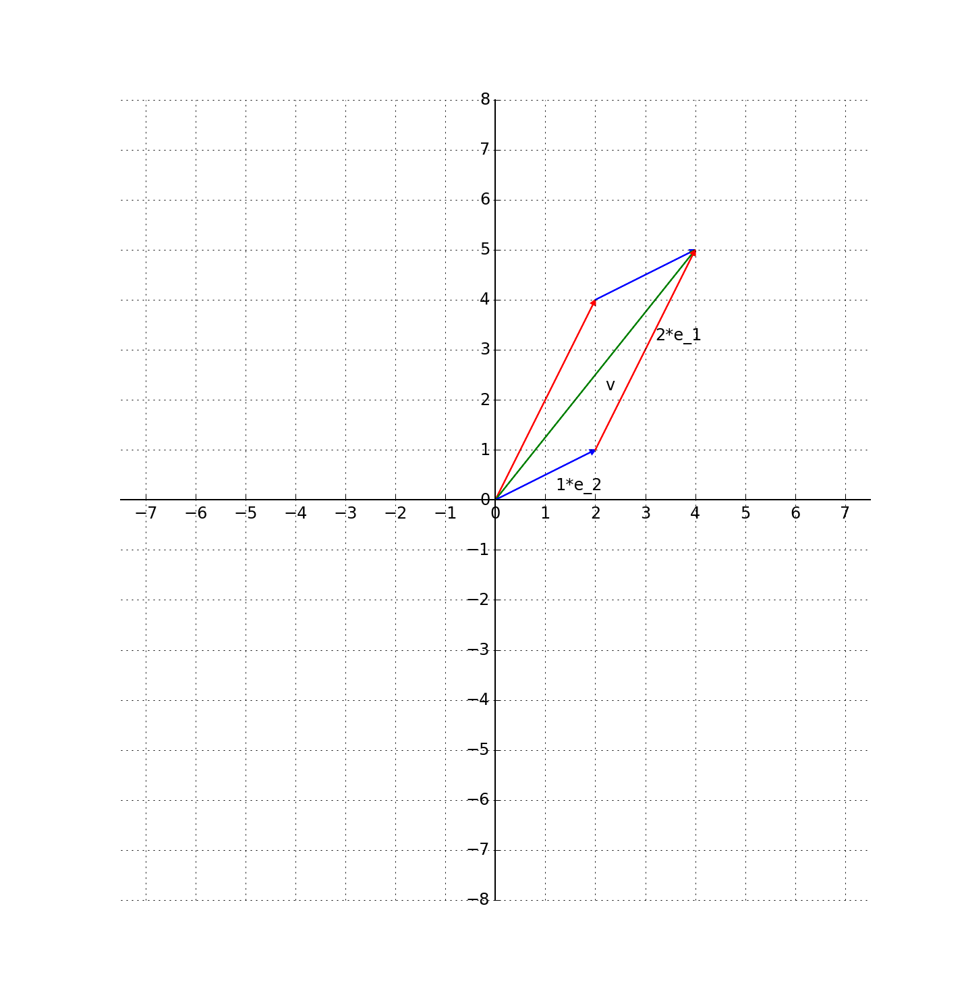
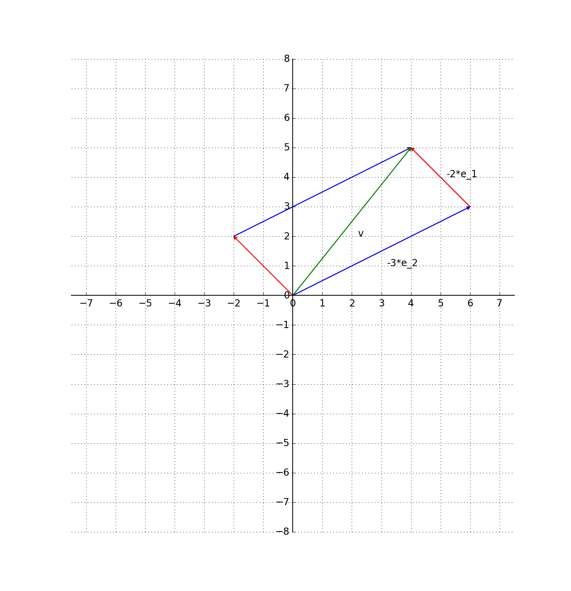

有了向量空间做基础，我们终于可以讨论线性代数的核心概念了：**线性变换**。线性代数大体上就是在研究**线性变换能改变什么，又不能改变什么**。不过在正式讨论线性变换之前，先提出一个问题：为什么需要线性变换？

线性变换与向量空间的基密不可分。上一节我们已经提到了向量空间的基，但是没有举出具体的例子。在这里，我们仍以二维向量空间$$\mathbf{R}^2$$为例，给出几组基的例子。

## 1 向量的坐标

根据我们对向量空间基的定义，所有的向量都可以用基向量数乘后再相加来表示。假设$$\mathbf{R}^2$$的基向量为$$ \left \\{ \mathbf{e_1} \quad \mathbf{e_2}\right\\}$$，即对于任意的向量$$\mathbf{v}$$，都可以表示为

$$\mathbf{v} = x\*\mathbf{e_1}  + y \*\mathbf{e_2} $$

此时，我们称**向量$$\mathbf{v} $$在基$$ \left \\{ \mathbf{e_1} \quad \mathbf{e_2}\right\\}$$下的坐标为$$ \begin{bmatrix} x & y \end{bmatrix}$$。**

接下来我们分析下图所示的向量$$\mathbf{v} $$在不同基下的坐标。

### 1.1 第一组基

其实，我们在使用向量空间之前，已经不自觉的用过基向量了。比如我们在《几何视角下的线性代数-序》那篇文章中，提到向量$$\mathbf{a} = \begin{bmatrix} 2 & 1 \end{bmatrix}$$，其实这就隐含着使用了下式所示的基向量：

$$\mathbf{e_1} =  \begin{bmatrix} 1 & 0 \end{bmatrix} \quad

\mathbf{e_2} =  \begin{bmatrix} 0 & 1 \end{bmatrix}$$

显然，对于向量$$\mathbf{a}$$有

$$\mathbf{a} = 2\*\mathbf{e_1}  + 1 \*\mathbf{e_2} $$

在这一组基表示下，$$\mathbf{v} $$的坐标为$$ \begin{bmatrix} 4 & 5 \end{bmatrix}$$。如下图所示：

### 1.2 第二组基

这一次，我们换一组基向量，令：

$$
\mathbf{e_1} =  \begin{bmatrix} 1 & 2 \end{bmatrix} \quad
\mathbf{e_2} =  \begin{bmatrix} 2 & 1 \end{bmatrix}
$$

在这组基下，向量$$\mathbf{v}$$可以表示为：

$$\mathbf{v} = 2\*\mathbf{e_1}  + 1 \*\mathbf{e_2} $$

也就是说，在这组基下，向量$$\mathbf{v}$$的坐标为$$\begin{bmatrix} 2 & 1 \end{bmatrix}$$，如下图所示：

### 1.3 第三组基

我们再来看第三组基向量：

$$\mathbf{e_1} =  \begin{bmatrix} 1 & -1 \end{bmatrix} \quad

\mathbf{e_2} =  \begin{bmatrix} -2 & -1 \end{bmatrix}$$

在这组基向量下，向量$$\mathbf{v}$$的坐标为$$\begin{bmatrix} -2 & -3 \end{bmatrix}$$，如下图所示：

从以上的分析结果来看，同一个向量$$\mathbf{v}$$在三组基向量的坐标分别为：$$ \begin{bmatrix} 4 & 5 \end{bmatrix}$$，$$ \begin{bmatrix} 2 & 1 \end{bmatrix}$$，$$\begin{bmatrix} -2 & -3 \end{bmatrix}$$。这意味着：同一个向量，在不同的基表示下，坐标不一样。当我们说向量的坐标是什么时，也必须同时说明这组坐标是在哪组基下得到的。

那么，一个自然的问题就是：**同一向量在不同基下的坐标如何转换？这正是线性变换要回答的问题。**

## 2 现实生活中的坐标变换

我们上面的选的三组基有点刻意为之了，当然会有同学疑问：为什么要搞这么多组基，大家都商量好使用第一组基不就好了吗。

然而在现实生活中，有很多地方都要求我们必须使用不同的基（即不同的坐标系）。我举两个领域的例子。

### 2.1 卫星轨道计算

对于在天上的卫星，需要使用雷达探测来获取卫星的位置。然而各地的雷达获取的的都是本地坐标系的测量值，如果要综合利用各地所有雷达的测量值，则必须要把不同雷达的测量值转换到一个统一的坐标系中。

### 2.2 计算机图形学

我们在玩大型3D游戏的时候，都有用鼠标拖动屏幕切换视角的经验，这其实就是对游戏中的虚拟世界进行实时坐标变换，并将变换结果再投影到屏幕上。这中间牵扯到的一系列坐标变换，正是计算机图形学的主要研究内容。
