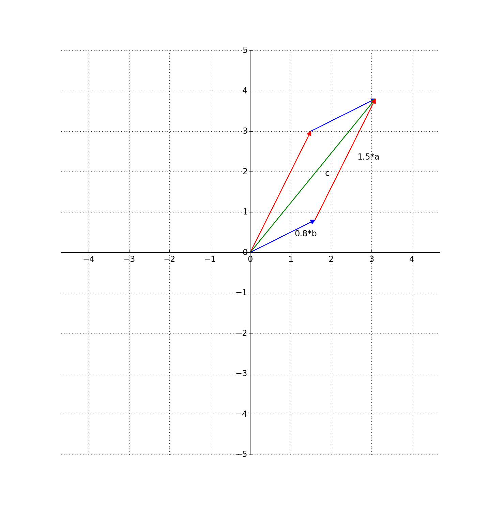

上一节我们定义了向量，并讨论了向量的加法和数乘。这一节我们来讨论向量空间。

## 1 什么是空间

在了解向量空间之前，首先要搞明白什么是空间。数学中的空间和“空间站”中的空间不一样，不是空荡荡的。下文所说的空间都是数学意义上的空间。

数学上的空间其实就是一个集合，并且对集合内的元素定义了某些运算。

空间的组成要素就这两点：集合，集合内元素定义的运算。

空间最要紧的一点就是要满足封闭性，意思是说集合内元素的运算结果还要在集合内。这么讲还是有点抽象，我们先举几个例子：

比如将所有的自然数构成一个集合：0,1,2,3,4…显然，任意两个自然数相加或者相乘之后，还是自然数。即自然数对加法和乘法满足封闭性，我们就称自然数对加法和乘法运算构成了一个空间。

但是，自然数对减法就不满足封闭性，1-2的结果为-1，-1不是自然数，所以自然数对于减法运算就构不成空间了。

假设我们将自然数这个集合扩大一点，考虑所有的整数，显然，整数对加法、减法、乘法运算都满足封闭性，所以这也是一个空间。

但是整数对于除法运算不满足封闭性，1/2=0.5, 0.5不是整数。所以加上除法运算后，整数就构不成一个空间了。

从上面的讨论可以看出，对于同一个集合，定义的运算不一样了，或者对于同一组运算，集合不一样了，都会影响对空间的判定。所以，讨论空间时，集合和运算二者缺一不可，必须同时定义好。

> 数学系的同学此时可以看出，我这所谓的空间概念，其实是对群的定义做了大幅度的简化。我知道这样不严谨，但是为了易懂，希望大家能够理解。

## 2 什么是向量空间

有了空间的概念，我们来讨论向量空间。顾名思义，**向量空间就是以向量为元素的空间**。

我们在上一篇文章里，给向量定义了两种运算：加法和数乘。向量的减法只是加法和数乘的结合，我们就不再单独提了。

所以，根据上一节的讨论。向量空间内的元素要对**加法和数乘两种运算满足封闭性**。那么，究竟什么样的集合够资格成为一个向量空间呢。

还是从我们简单可爱的二维向量说起吧。

首先思考一下：二维向量能构成最简单的空间是什么？

考虑只有零向量的集合{$$\mathbf{o}$$}，零向量的定义为$$\mathbf{o} = \begin{bmatrix} 0  & 0 \end{bmatrix}$$。显然两个零向量相加还是零向量，零向量和任何数相乘也是零向量。amazing，这只有一个元素的集合居然是一个向量空间！

再考虑在一条过原点直线上的所有向量构成的集合。两个向量相加得到的新向量依然落在这条直线上。向量的数乘也不会改变向量的方向。所以封闭性满足。这也是一个向量空间。

### 2.1 二维向量空间

我们的胃口再大一点，这次考虑二维平面上的所有向量构成的集合。容易看出来，这些向量对加法和数乘都满足封闭性。因此，二维平面上的所有向量构成了一个向量空间，因为这个向量空间很常用，所以数学上将其记为$$\mathbf{R}^2$$.

### 2.2 高维向量空间

类似的，对于三维空间中的所有向量构成的集合，也形成了一个向量空间，记做$$\mathbf{R}^3$$。我们继续更高维推广，所有n维向量构成的集合，都是向量空间，记做$$\mathbf{R}^n$$.

## 3 向量空间的基

现在考虑二维平面内所有向量构成的向量空间$$\mathbf{R}^2$$。有一个小精灵住在原点处，在这个时候，根据向量的定义，小精灵只需要一根向量即可达到平面上的任意点。现在让我们做一回这个二维向量空间的上帝，我们蛮横的规定：小精灵只允许按照两个方向$$\mathbf{a},\mathbf{b}$$来走，那么小精灵还能到达那些点？

答案还是任意点。我们首先选取目的地，连接原点构成向量$$\mathbf{c}$$，然后将向量$$\mathbf{c}$$作为平行四边形的对角线，以向量$$\mathbf{a},\mathbf{b}$$为方向构造平行四边形就可以了。只不过原先只需要一根向量的路，现在需要两根了。注意，此时平行四边形边的方向和向量$$\mathbf{a},\mathbf{b}$$平行，但是长短并不一样，也就是说平行四边形两边是向量$$\mathbf{a},\mathbf{b}$$的数乘。

这等价于说明，平面内的任何一根向量都可以用两根不共线向量$$\mathbf{a},\mathbf{b}$$来表示：只需要先对这两根向量做合适的数乘，再将数乘结果相加即可。为了表明这两根向量的特殊地位，我们将这两根向量称之为**基向量**。并称这两个向量构成了二维向量空间的一组基。

## 4 为什么要定义向量空间？

我不太喜欢教科书上一开始直接给出向量空间完美定义的行为。在引入一个新的数学概念时，我一般会想，为什么要引入这个概念？

向量空间是高等数学中基础的基础，有相当多的衍生品。比如加上范数的定义就构成了赋范向量空间，加上了内积就构成了内积空间，加上范数和完备性就构成了泛函分析里把大家虐了八百遍的Banach空间。

这就是抽象的好处，一个**概念越抽象，普适性就越强，而代价则是增加了理解的难度**。

向量空间如此抽象，以至于很难找到在现实世界符合向量空间定义的例子。我能想到的最接近的例子就是自然语言处理中的词空间(word embedding)。我在上一节说过，深度学习操作的基本单位就是向量。为了利用深度学习来进行语言研究，必须把单词表示为向量，也就是把一个个单词分别映射为向量，这些所有的向量就构成了词向量空间。在映射到向量空间中之后，这些向量依然能保持良好的单词语义。

比如所有表示城市的向量：北京、上海、广州等等会在向量空间里聚拢在一堆；而所有表示水果的向量：苹果、香蕉、菠萝等等会在向量空间中聚拢在另外一堆。甚至还有更加高级的语义特性，比如$$\overrightarrow {man}-\overrightarrow {woman}$$会大致等于$$\overrightarrow {king}-\overrightarrow {queen}$$。

这些语义保持的特性会为后续的语言处理带来很多方便，比如在这种向量空间里对单词聚类简直是易如反掌，再比如把中文和英文都分别映射到向量空间，只要分析这两个向量空间的对应结构，就可以完成机器翻译了。
